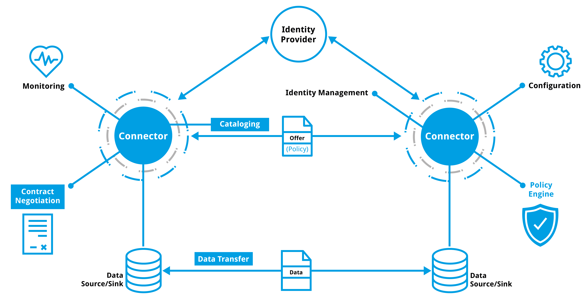

# Dataspace Protocol Release 2024-1

> __NOTE:__ For GitHub users, the link to the rendered content is [https://docs.internationaldataspaces.org/dataspace-protocol/](https://docs.internationaldataspaces.org/dataspace-protocol/).
>
> __NOTE:__ The human-friendly version of this specification in the [IDSA Knowledge base](https://docs.internationaldataspaces.org/dataspace-protocol/) will always show the latest version of the document. The version history and changes are provided via the [GitHub Repository](https://github.com/International-Data-Spaces-Association/ids-specification/).

## About versions of the Dataspace Protocol

This version ([2024-1](https://github.com/International-Data-Spaces-Association/ids-specification/tree/main/releases/2024-1)) of the Dataspace Protocol specification is the release candidate and considered to be stable. Further changes shall not affect conformity.
  Since [version 0.8](https://github.com/International-Data-Spaces-Association/ids-specification/tree/main/releases/v0.8) the specification is stable with changes in details. All changes made to the specification can be reviewed in the [GitHub repository](https://github.com/International-Data-Spaces-Association/ids-specification/).

> __NOTE:__ A versioning scheme beside the commits to the repository is not available but will be provided in the future.

## Abstract

The __Dataspace Protocol__ is a set of specifications designed to facilitate interoperable data sharing between entities governed by usage control and based on Web technologies. These specifications define the schemas and protocols required for entities to publish data, negotiate [Agreements](./model/terminology.md#agreement), and access data as part of a federation of technical systems termed a [Dataspace](./model/terminology.md#dataspace).

## Introduction

Sharing data between autonomous entities requires the provision of metadata to facilitate the transfer of [Datasets](./model/terminology.md#dataset) by making use of a data transfer (or application layer) protocol.
The __Dataspace Protocol__ defines how this metadata is provisioned:

1. How [Datasets](./model/terminology.md#dataset) are deployed as [DCAT Catalogs](https://www.w3.org/TR/vocab-dcat-3/#Class:Catalog) and usage control is expressed as [ODRL Policies](https://www.w3.org/TR/odrl-model/).
2. How [Agreements](./model/terminology.md#agreement) that govern data usage are syntactically expressed and electronically negotiated.
3. How [Datasets](./model/terminology.md#dataset) are accessed using [Transfer Process Protocols](./model/terminology.md#transfer-process-protocol).

These specifications build on protocols located in the [ISO OSI model (ISO/IEC 7498-1:1994)](https://www.iso.org/standard/20269.html) layers, like HTTPS.
The purpose of this specification is to define interactions between systems independent of such protocols, but describing how to implement it in an unambiguous and extensible way.
To do so, the messages that are exchanged during the process are described in this specification and the states and their transitions are specified as state machines, based on the key terms and concepts of a [Dataspace](./model/terminology.md#dataspace).
On this foundation the bindings to data transfer protocols, like HTTPS, are described.

The specifications are organized into the following documents:

* [__*Dataspace Model*__](./model/model.md) and [__*Dataspace Terminology*__](./model/terminology.md) documents that define key terms.
* [__*Common Functionalities*__](./common/common.protocol.md) and their [__*Binding in HTTPS*__](./common/common.binding.https.md) declares cross-cutting functions as, e.g., the declaration of supported versions of this Dataspace Protocol.
* [__*Catalog Protocol*__](./catalog/catalog.protocol.md) and [__*Catalog HTTPS Binding*__](./catalog/catalog.binding.https.md) documents that define how [DCAT Catalogs](https://www.w3.org/TR/vocab-dcat-3/#Class:Catalog) are published and accessed as HTTPS endpoints respectively.
* [__*Contract Negotiation Protocol*__](./negotiation/contract.negotiation.protocol.md) and [__*Contract Negotiation HTTPS Binding*__](./negotiation/contract.negotiation.binding.https.md) documents that define how [Contract Negotiations](./model/terminology.md#contract-negotiation) are conducted and requested via HTTPS endpoints.
* [__*Transfer Process Protocol*__](./transfer/transfer.process.protocol.md) and [__*Transfer Process HTTPS Binding*__](./transfer/transfer.process.binding.https.md) documents that define how [Transfer Processes](./model/terminology.md#transfer-process) using a given data transfer protocol are governed via HTTPS
  endpoints.

> **This specification does not cover the data transfer process as such.**
>
> While the data transfer is controlled by the __*Transfer Process Protocol*__ mentioned above, e.g. the initation of the transfer channels or their decomissioning, the data transfer itself and especially the handling of technical exceptions is an obligation to the Transport Protocol.
>
> As an implication, the data transfer can be conducted in a separated process if required, as long as this process is to the specified extend controlled by the __*Transfer Process Protocol*__.
>
> Nevertheless, illustrative message examples are provided in the [__*Transfer Process Protocol section*__](./transfer/transfer.process.protocol.md#2-message-types). The best practices section may contain further non-normative examples and explanations.

### Context of this specification

The __Dataspace Protocol__ is used in the context of [Dataspaces](./model/terminology.md#dataspace) as described and defined in the subsequent sections with the purpose to support interoperability.
In this context, the specification provides fundamental technical interoperability for [Participants](./model/terminology.md#participant) in [Dataspaces](./model/terminology.md#dataspace).
Beyond the technical interoperability measures described in this specification, semantic interoperability should also be addressed by the [Participants](./model/terminology.md#participant). On the perspective of the [Dataspace](./model/terminology.md#dataspace), interoperability needs to be addressed also on the level of trust, on organizational levels, and on legal levels.
The aspect of cross-dataspace communication is not subject of this document, as this is addressed by the [Dataspaces'](./model/terminology.md#dataspace) organizational and legal agreements.

The interaction of [Participants](./model/terminology.md#participant) in a [Dataspace](./model/terminology.md#dataspace) is conducted by the [Participant Agents](./model/terminology.md#participant-agent), so-called [Connectors](./model/terminology.md#connector--data-service-), which implement the protocols described above.
While most interactions take place between [Connectors](./model/terminology.md#connector--data-service-), some interactions with other systems are required.
The figure below provides an overview on the context of this specification.

An [Identity Provider](./model/terminology.md#identity-provider) realizes the required interfaces and provides required information to implement the Trust Framework of a [Dataspace](./model/terminology.md#dataspace).
The validation of the identity of a given [Participant Agent](./model/terminology.md#participant-agent) and the validation of additional claims is a fundamental mechanism. The structure and content of such claims and identities may, however, vary between different [Dataspaces](./model/terminology.md#dataspace), as well as the structure of such an [Identity Provider](./model/terminology.md#identity-provider), e.g. a centralized system, a decentralized system or a federated system. Other specifications, like the Identity and Trust Protocol ([IATP](https://github.com/eclipse-tractusx/identity-trust)), define the respective functions.

A [Connector](./model/terminology.md#connector--data-service-) will implement additional internal functionalities, like monitoring or policy engines, as appropriate. It is not covered by this specification if a [Connector](./model/terminology.md#connector--data-service-) implements such or how.

The same applies for the actual data that is transferred between the systems. While this document does not define the transport protocol, the structure, syntax or semantics of the data, a specification for those aspects is required and subject to the agreements of the [Participants](./model/terminology.md#participant) or the [Dataspace](./model/terminology.md#dataspace).

## Best Practices

The Dataspace Protocol is under development and the working group is active on this draft, reviewed and improved the content multiple times. During the process several aspects were discussed, which are not considered part of the normative specification, but important to be documented as support for the users of this specification as best practices. The [Best Practices](./best.practices/README.md) are non-normative.

Users of this specification are invited to provide feedback such as, but not limited to:

* What information is missing?
* What information, including examples, would you like to see?
* What did you like in this document?

Please provide your feedback as Issue in our [GitHub repository](https://github.com/International-Data-Spaces-Association/ids-specification/issues).
