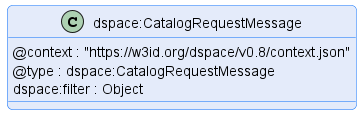
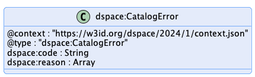

# Catalog Protocol

This document outlines the [Catalog Protocol](../model/terminology.md#catalog-protocol). The used terms are described [here](../model/terminology.md).

- [Catalog Protocol](#catalog-protocol)
  - [1 Introduction](#1-introduction)
    - [1.1 DCAT Vocabulary Mapping](#11-dcat-vocabulary-mapping)
      - [1.1.1 Dataset](#111-dataset)
        - [odrl:hasPolicy](#odrlhaspolicy)
      - [1.1.2 Distributions](#112-distributions)
      - [1.1.3 Data Service](#113-data-service)
        - [dspace:dataServiceType](#dspacedataservicetype)
        - [dcat:servesDataset](#dcatservesdataset)
    - [1.2 DCAT and ODRL Profiles](#12-dcat-and-odrl-profiles)
  - [2 Message Types](#2-message-types)
    - [2.1 Catalog Request Message](#21-catalog-request-message)
    - [2.2 Dataset Request Message](#22-dataset-request-message)
  - [3 Response Types](#3-response-types)
    - [3.1 ACK - Catalog](#31-ack---catalog)
    - [3.2 ACK - Dataset](#32-ack---dataset)
    - [3.3 ERROR - Catalog Error](#33-error---catalog-error)
  - [4 Technical Considerations](#4-technical-considerations)
    - [4.1 Queries and Filter Expressions](#41-queries-and-filter-expressions)
    - [4.2 Replication Protocol](#42-replication-protocol)
    - [4.3 Security](#43-security)
      - [4.3.1 The Proof Metadata Endpoint](#431-the-proof-metadata-endpoint)
    - [4.4 Catalog Brokers](#44-catalog-brokers)

## 1 Introduction

The Catalog Protocol defines how a [Catalog](../model/terminology.md#catalog) is requested from a [Catalog Service](../model/terminology.md#catalog-service) by a [Consumer](../model/terminology.md#consumer) using an abstract message exchange format. The concrete message exchange wire format is defined in the binding specifications.

### 1.1 DCAT Vocabulary Mapping

This section describes how the DSP Information Model maps to [DCAT](https://www.w3.org/TR/vocab-dcat-3/) resources.

#### 1.1.1 Dataset

A [Dataset](../model/terminology.md#dataset) is a [DCAT Dataset](https://www.w3.org/TR/vocab-dcat-3/#Class:Dataset) with the following attributes:

##### odrl:hasPolicy

A [Dataset](../model/terminology.md#dataset) must have 1..N `hasPolicy` attributes that contain an [ODRL `Offer`](https://www.w3.org/TR/odrl-vocab/#term-Offer) defining the [Usage Policy](../model/terminology.md#policy) associated with the [Catalog](../model/terminology.md#catalog). Offers must NOT contain any
explicit `target` attributes. The `target` of an [Offer](../model/terminology.md#offer) is the associated [Dataset](../model/terminology.md#dataset). This is in line with the semantics of `hasPolicy` as defined in the [ODRL Information Model](https://www.w3.org/TR/odrl-model/#policy-has), explaining that the subject (here the Dataset) is automatically the `target` of each Rule. To prevent conflicts, the `target` attribute must not be set explicitely, for example, in the [Offer](../model/terminology.md#offer) or Rules. 

#### 1.1.2 Distributions

A [Dataset](../model/terminology.md#dataset) may contain 0..N [DCAT Distributions](https://www.w3.org/TR/vocab-dcat-3/#Class:Distribution). Each distribution must have at least one `DataService` which specifies where the distribution is obtained. Specifically, a `DataService` specifies the endpoint for initiating a [Contract Negotiation](../model/terminology.md#contract-negotiation) and [Transfer Process](../model/terminology.md#transfer-process).

A Distribution may have 0..N `hasPolicy` attributes that contain an [ODRL Offer](https://www.w3.org/TR/odrl-vocab/#term-Offer) defining the [Usage Policy](../model/terminology.md#policy) associated with the [Dataset](../model/terminology.md#dataset) and this explicit `Distribution`. [Offers](../model/terminology.md#offer) must NOT contain any target attributes. The target of an [Offer](../model/terminology.md#offer) is the [Dataset](../model/terminology.md#dataset) that contains the distribution.

Support for `hasPolicy` attributes on a `Distribution` is optional. Implementations may choose not to support this feature, in which case they should return an appropriate error message to clients.

#### 1.1.3 Data Service

A Data Service may specify an endpoint supporting the Dataspace Protocol such as a [Connector](../model/terminology.md#connector--data-service-).

##### dspace:dataServiceType

If the Data Service refers to an endpoint that supports the Dataspace Protocol, it must include the property `dspace:dataServiceType`:

| Category   | Description                                                                |
|------------|----------------------------------------------------------------------------|
| Definition | Specifies the service type                                                 |
| Domain     | [dcat:DataService](https://www.w3.org/TR/vocab-dcat-2/#Class:Data_Service) |
| Type       | xsd:string                                                                 |
| Note       | The value of this field is left intentionally open for future extension.   |

The following table lists well-know endpoint types:

| Value              | Description                                                               |
|--------------------|---------------------------------------------------------------------------|
| `dspace:connector` | A [Connector](../model/terminology.md#connector--data-service-) endpoint. |
|                    |                                                                           |

##### dcat:servesDataset

Note that the property `dcat:servesDataset` should be omitted from the `DataService` since [Datasets](../model/terminology.md#dataset) are included as top-level entries. Clients are not required to process the contents of `dcat:servesDataset`.

#### 1.1.4 Participant Id

The identifier of the participant providing the `Catalog` is specified using the `dspace:participantId` attribute on that `DCAT Catalog`.

### 1.2 DCAT and ODRL Profiles

The [Catalog](../model/terminology.md#catalog) is a [DCAT Catalog](https://www.w3.org/TR/vocab-dcat-3/#Class:Catalog) with the following restrictions:

1. Each [ODRL `Offer`](https://www.w3.org/TR/odrl-vocab/#term-Offer) must be unique to a [Dataset](../model/terminology.md#dataset) since the target of the [Offer](../model/terminology.md#offer) is derived from its enclosing context. 
2. A [Catalog](../model/terminology.md#catalog) must not have an `odrl:hasPolicy` attribute, since it is not intended to negotiate on the access to [Catalog](../model/terminology.md#catalog) objects. An implementation might however regulate the visibility and/or the content of its [Catalog](../model/terminology.md#catalog) dependent of the requester. 

## 2 Message Types

All messages must be serialized in JSON-LD compact form as specified in the [JSON-LD 1.1 Processing Algorithms and API](https://www.w3.org/TR/json-ld11-api/#compaction-algorithms). Further [Dataspace](../model/terminology.md#dataspace) specifications may define additional optional serialization formats.

### 2.1 Catalog Request Message

|                     |                                                                                                                                     |
|---------------------|-------------------------------------------------------------------------------------------------------------------------------------|
| **Sent by**         | [Consumer](../model/terminology.md#consumer)                                                                                        |
| **Resulting state** | `TERMINATED`                                                                                                                        |
| **Response**        | [ACK](#31-ack---catalog) or [ERROR](#33-error---catalog-error)                                                                      |
| **Schema**          | [TTL Shape](./message/shape/catalog-request-message-shape.ttl), [JSON Schema](./message/schema/catalog-request-message-schema.json) |
| **Example**         | [Message](./message/example/catalog-request-message.json)                                                                           |
| **Diagram(s)**      |                                                                                   |

The Catalog Request Message is message sent by a [Consumer](../model/terminology.md#consumer) to a [Catalog Service](../model/terminology.md#catalog-service). The [Catalog Service](../model/terminology.md#catalog-service) must respond with a [Catalog](#31-ack---catalog), which is a valid instance of a [DCAT Catalog](https://www.w3.org/TR/vocab-dcat-3/#Class:Catalog).

- The message may have a `filter` property which contains an implementation-specific query or filter expression type supported by the [Catalog Service](../model/terminology.md#catalog-service).

- The [Catalog Service](../model/terminology.md#catalog-service) may require an authorization token. Details for including that token can be found in the protocol binding, e.g., [Catalog HTTPS Binding](./catalog.binding.https.md). Similarly, pagination may be defined in the protocol binding.

### 2.2 Dataset Request Message

|                     |                                                                                                                                     |
|---------------------|-------------------------------------------------------------------------------------------------------------------------------------|
| **Sent by**         | [Consumer](../model/terminology.md#consumer)                                                                                        |
| **Resulting state** | `TERMINATED`                                                                                                                        |
| **Response**        | [ACK](#31-ack---catalog) or [ERROR](#33-error---catalog-error)                                                                      |
| **Schema**          | [TTL Shape](./message/shape/dataset-request-message-shape.ttl), [JSON Schema](./message/schema/dataset-request-message-schema.json) |
| **Example**         | [Message](./message/example/dataset-request-message.json)                                                                           |
| **Diagram(s)**      |                                                                                   |

The Dataset Request Message is message sent by a [Consumer](../model/terminology.md#consumer) to a [Catalog Service](../model/terminology.md#catalog-service). The [Catalog Service](../model/terminology.md#catalog-service) must respond with a [Dataset](#32-ack---dataset), which is a valid instance of a [DCAT Dataset](https://www.w3.org/TR/vocab-dcat-3/#Class:Dataset).

- The message must have a `dataset` property which contains the id of the [Dataset](../model/terminology.md#dataset).

- The [Catalog Service](../model/terminology.md#catalog-service) may require an authorization token. Details for including that token can be found in the protocol binding, e.g., [Catalog HTTPS Binding](./catalog.binding.https.md).

## 3 Response Types

The `ACK` and `ERROR` response types are mapped onto a protocol such as HTTPS. A description of an error might be provided in protocol-dependent forms, e.g., for an HTTPS binding in the request or response body.

### 3.1 ACK - Catalog

|                 |                                                                                                   |
|-----------------|---------------------------------------------------------------------------------------------------|
| **Sent by**     | [Provider](../model/terminology.md#provider)                                                      |
| **Schema**      | [TTL Shape](./message/shape/dcat-shapes.ttl), [JSON Schema](./message/schema/catalog-schema.json) |
| **Example**     | [Catalog Example](./message/example/catalog.json)                                                 |
| **Diagram(s)**  |                                                                 |

The [Catalog](../model/terminology.md#catalog) contains all [Datasets](#111-dataset) which the requester shall see.

### 3.2 ACK - Dataset

|                 |                                                                                                   |
|-----------------|---------------------------------------------------------------------------------------------------|
| **Sent by**     | [Provider](../model/terminology.md#provider)                                                      |
| **Schema**      | [TTL Shape](./message/shape/dcat-shapes.ttl), [JSON Schema](./message/schema/dataset-schema.json) |
| **Example**     | [Dataset Example](./message/example/dataset.json)                                                 |
| **Diagram(s)**  |                                                                 |

### 3.3 ERROR - Catalog Error

|                 |                                                                                                                 |
|-----------------|-----------------------------------------------------------------------------------------------------------------|
| **Sent by**     | [Consumer](../model/terminology.md#consumer), [Provider](../model/terminology.md#provider)                      |
| **Schema**      | [TTL Shape](./message/shape/catalog-error-shape.ttl), [JSON Schema](./message/schema/catalog-error-schema.json) |
| **Example**     | [Error](./message/example/catalog-error.json)                                                                   |
| **Diagram(s)**  |                                                                         |

A Catalog Error is used when an error occurred after a [Catalog Request Message](#21-catalog-request-message) or a [Dataset Request Message](#22-dataset-request-message) and the [Provider](../model/terminology.md#provider) cannot provide its [Catalog](../model/terminology.md#catalog) to the requester.

| Field     | Type          | Description                                                 |
|-----------|---------------|-------------------------------------------------------------|
| `code`    | String        | An optional implementation-specific error code.             |
| `reasons` | Array[object] | An optional array of implementation-specific error objects. |

## 4 Technical Considerations

### 4.1 Queries and Filter Expressions

A [Catalog Service](../model/terminology.md#catalog-service) may support [Catalog](../model/terminology.md#catalog) queries or filter expressions as an implementation-specific feature. However, it is expected that query capabilities will be implemented by the [Consumer](../model/terminology.md#consumer) against the results of a [Catalog Request Message](#21-catalog-request-message), as the latter is an RDF vocabulary. Client-side querying can be scaled by periodically crawling the [Provider's](../model/terminology.md#provider) [Catalog Services](../model/terminology.md#catalog-service), caching the results, and executing queries against the locally-stored [Catalogs](../model/terminology.md#catalog).

### 4.2 Replication Protocol

The [Catalog Protocol](../model/terminology.md#catalog-protocol) is designed to be used by federated services without the need for a replication protocol. Each [Consumer](../model/terminology.md#consumer) is responsible for issuing requests to 1..N [Catalog Services](../model/terminology.md#catalog-service), and managing the results. It follows that a specific replication protocol is not needed, or more precisely, each [Consumer](../model/terminology.md#consumer) replicates data from catalog services by issuing [Catalog Request Messages](#21-catalog-request-message).

The discovery protocol adopted by a particular [Dataspace](../model/terminology.md#dataspace) defines how a [Consumer](../model/terminology.md#consumer) discovers [Catalog Services](../model/terminology.md#catalog-service).

### 4.3 Security

It is expected (although not required) that [Catalog Services](../model/terminology.md#catalog-service) implement access control. A [Catalog](../model/terminology.md#catalog) as well as individual [Datasets](../model/terminology.md#dataset) may be restricted to trusted parties. The [Catalog Service](../model/terminology.md#catalog-service) may require [Consumers](../model/terminology.md#consumer) to include a security token along with a [Catalog Request Message](#21-catalog-request-message). The specifics of how this is done can be found in the relevant protocol binding, e.g., [Catalog HTTPS Binding](./catalog.binding.https.md). The semantics of such tokens are not part of this specification.

#### 4.3.1 The Proof Metadata Endpoint

When a [Catalog](../model/terminology.md#catalog) contains protected [Datasets](../model/terminology.md#dataset) the [Provider](../model/terminology.md#provider) has two options: include all [Datasets](../model/terminology.md#dataset) in the [Catalog](../model/terminology.md#catalog) response and restrict access when a contract is negotiated; or, require one or more proofs when the [Catalog Request](#21-catalog-request-message) is made and filter the [Datasets](../model/terminology.md#dataset) accordingly. The latter option requires a mechanism for clients to discover the type of proofs that may be presented at request time. The specifics of proof types and presenting a proof during a [Catalog](../model/terminology.md#catalog) request is outside the scope of the Dataspace Protocol. However, [Catalog Protocol](../model/terminology.md#catalog-protocol) bindings should define a proof data endpoint for obtaining this information.  

### 4.4 Catalog Brokers

A [Dataspace](../model/terminology.md#dataspace) may include Catalog Brokers. A Catalog Broker is a [Consumer](../model/terminology.md#consumer) that has trusted access to 1..N upstream [Catalog Services](../model/terminology.md#catalog-service) and advertises their respective [Catalogs](../model/terminology.md#catalog) as a single [Catalog Service](../model/terminology.md#catalog-service). The broker is expected to honor upstream access control requirements.
