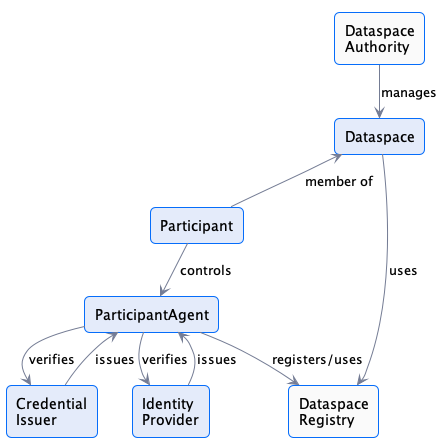
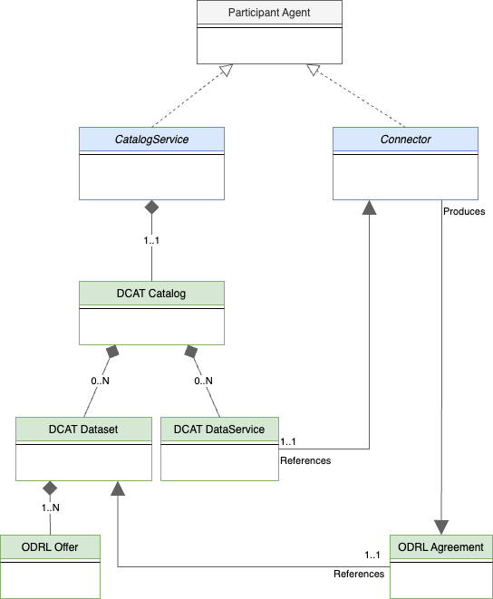

# 2 Dataspace Model

## 2 Dataspace Information Model

The following sections outline the Dataspace Information Model, which form the foundation of this specification.
Some aspects of this section describe additional concepts of Dataspaces and provide context for the Dataspace Protocol,
those are considered as not-normative. Further information on the functional requirements of a Dataspace can be found in
the [IDSA Rulebook](https://docs.internationaldataspaces.org/idsa-rulebook).

### 2.1 Dataspace Entity Relationships

#### 2.1.1 Context of the Dataspace Protocol

In a broader context, the Dataspace Protocol enables the interaction between participants of
a Dataspace. This may require addiotonal concepts, which are not in scope of this specification.
The definitions below are therefore informative and not-normative.

The relationships between the primary dataspace entities are defined as follows:

Note that all relationships are multiplicities unless specified.

- A `Dataspace Authority` manages one or more `Dataspaces`. This will include participant registration and may entail mandating business and/or requirements. For example, a
  Dataspace Authority may require participants to obtain some form of business certification. A Dataspace authority may also impose technical requirements such as support for the
  technical enforcement of specific usage policies.
- A `Participant` is a member of one or more `Dataspaces`. A participant registers `Participant Agents` that perform tasks on its behalf.
- A `Dataspace Registry` manages the registered `Participant Agents` in a `Dataspace`. Registration and unregistration processes may be different depending on various aspects.
- A `Participant Agent` performs tasks such as publishing a catalog or engaging in an asset transfer. In order to accomplish these tasks, a participant agent may
  use a _**verifiable presentation**_ generated from a _**credential**_ obtained from a third-party issuer. A participant agent may also use an _**ID token**_ issued by a
  third-party identity provider. Note that a participant agent is a logical construct and does not necessarily correspond to a single runtime process.
- An `Identity Provider` is a trust anchor that generates `ID tokens` used to verify the identity of a `Participant Agent`. Multiple identity providers may operate in
  a dataspace. The types and semantics of ID tokens are not part of this specification. An identity provider may be a third-party or a participant itself (for example, in the case
  of decentralized identifiers).
- A `Credential Issuer` issues _verifiable credentials_ used by participant agents to allow access to assets and verify usage control.

Further information on the context of the Dataspace Protocol can be found in the [IDSA Rulebook](https://docs.internationaldataspaces.org/idsa-rulebook).

#### 2.1.2 Dataspace Protocol specific

The Dataspace Protocol shall enable the interactions between the `ParticipantAgents` in a Dataspace.
The following concepts are therefore normative.

The diagram below depicts the relationships between `ParticipantAgent` types:

- A `CatalogService` is a `Participant Agent` that makes a [DCAT Catalog](https://www.w3.org/TR/vocab-dcat-3/#Class:Catalog) available to other participants.
- A `Catalog` contains one or more `Asset Entries`, which are [DCAT Datasets](https://www.w3.org/TR/vocab-dcat-3/#Class:Dataset). A `Catalog` also contains **_at least one_**
  [DCAT DataService](https://www.w3.org/TR/vocab-dcat-3/#Class:Data_Service) that references a `Connector` where assets may be obtained.
- An `Asset Entry` has **one** `Offer`, which is an [ODRL Offer](https://www.w3.org/TR/odrl-model/#policy-offer) describing the _usage control policy_ associated with the asset.
- A `Connector` is a `Participant Agent` that performs `Contract Negotiation` and `Asset Transfer` operations with another connector. An outcome of a `ContractNegotiation` may
  be the production of an `Agreement`, which is an [ODRL Agreement](https://www.w3.org/TR/odrl-model/#policy-agreement) defining the _usage control policy_ agreed to for an asset.

### 2.2 Classes

Not all dataspace entities have a concrete _technical_ materialization; some entities may exist as purely logical constructs. For example, a `Dataspace Authority`
and `Participant Agent` have no representation in the protocol message flows that constitute dataspace interactions. This section outlines the classes that comprise the concrete
elements of the model, i.e. those that are represented in protocol message flows.

**_Note 1:_**
The classes and definitions used in the dataspace protocol are reused from different standards and specifications as much as possible, in particular, DCAT and ODRL. As, however, the external definitions allow different interpretations or provide more attributes than required, the dataspace protocol is leveraging _profiles_ of the original definitions rather than the complete original expressiveness. A _profile_ in this sense is a restriction or subset of an external definition, enforcing that every occurance of an externally defined class is always conformant with the original definition. However, not every standard-compliant class might be compliant to the dataspace profile.

#### 2.2.1 Catalog

A `Catalog` is a [DCAT Catalog](https://www.w3.org/TR/vocab-dcat-3/#Class:Catalog) with the following attributes:

- 0..N  `Asset Entries`. Since a catalog may be dynamically generated for a request based on the requesting participant's credentials it is possible for it to contain 0 matching
  asset entries. (DCAT PROFILE)
- 1..N [DCAT DataService](https://www.w3.org/TR/vocab-dcat-3/#Class:Data_Service) that references a `Connector` where assets may be obtained. (DCAT PROFILE)

#### 2.2.2 Asset Entry

An `Asset Entry` is a [DCAT Dataset](https://www.w3.org/TR/vocab-dcat-3/#Class:Dataset) with the following attributes:

- 1..N `hasPolicy` attributes that contain an ODRL `Offer` defining the usage control policy associated with the asset. **_Offers must NOT contain any target attributes. The
  target of an offer is the asset associated with the containing asset entry._** (ODRL PROFILE)
- 1..N [DCAT Distributions](https://www.w3.org/TR/vocab-dcat-3/#Class:Distribution). Each distribution must have at least one `DataService` which specifies where the distribution
  is obtained. Specifically, a `DataService` specifies the endpoint for initiating a `ContractNegotiation` and `AssetTransfer`. (DCAT PROFILE)

#### 2.2.3 Offer

An `Offer` is an [ODRL Offer](https://www.w3.org/TR/odrl-model/#policy-offer) with the following attributes:

- An ODRL `uid` is represented as an "@id" that is a unique UUID. (ODRL PROFILE)
- The `Offer` must be unique to a dataset since the target of the offer is derived from its enclosing context.
- The `Offer` must NOT include an explicit `target` attribute.

#### 2.2.4 Agreement

An `Agreement` is an [ODRL Agreement](https://www.w3.org/TR/odrl-model/#policy-agreement) with the following attributes:

- The `Agreement` class must include one `target` attribute that is the UUID of the asset the agreement is associated with. An agreement is therefore associated with **EXACTLY
  ONE** asset. (ODRL PROFILE)
