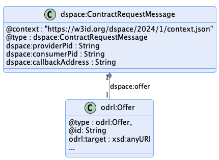

# Contract Negotiation Protocol

## Introduction: Terms

This document outlines the key elements of the contract negotiation protocol. The following terms are used:

- A _**message type**_ defines the structure of a _message_.
- A _**message**_  is an instantiation of a _message type_.
- The _**contract negotiation protocol**_ is the set of allowable message type sequences and is defined as a state machine (CNP-SM).
- A _**contract negotiation (CN)**_ is an instantiation of the CNP-SM.
- A _**provider**_ is a participant agent that offers an asset.
- A _**consumer**_ is a participant agent that requests access to an offered asset.

## Contract Negotiation Protocol

A contract negotiation (CN) involves two parties, a _provider_ that offers one or more assets under a usage contract and _consumer_ that requests assets.
A CN is uniquly identified through an IRI. Each CN requires a newly generated IRI, which may not be used in a CN after a terminal state has been reached.
A CN progresses through a series of states, which are tracked by the provider and consumer using messages. A CN transitions to a state in response to an acknowledged message from
the counter-party. Both parties have the same state of the CN. In case the states differ, the CN is terminated and a new CN has to be initiated.

The CN states are:

- **CONSUMER_REQUESTED** - A contract for an asset has been requested by the consumer based on an offer and the provider has sent an ACK response.
- **PROVIDER_OFFERED** - The provider has sent a contract offer to the consumer and the consumer has sent an ACK response.
- **CONSUMER_AGREED** - The consumer has accepted the latest contract offer and the provider has sent an ACK response.
- **PROVIDER_AGREED** - The provider has accepted the latest contract offer, sent an agreement to the consumer, and the consumer has sent an ACK response.
- **CONSUMER_VERIFIED** - The consumer has sent an agreement verification to the provider and the provider has sent an ACK response.
- **PROVIDER_FINALIZED** - The provider has sent a finalization message including his own agreement verification to the consumer and the consumer has sent an ACK response. Data is
  now available to the consumer.
- **TERMINATED** - The provider or consumer has placed the contract negotiation in a terminated state. A termination message has been sent by either of the participants and the
  other has sent an ACK response. This is a terminal state.

### Contract Negotiation State Machine

The CN state machine is represented in the following diagram. Note that transitions to the TERMINATED state may occur from any other state and are not shown for simplicity:

Transitions marked with `C` indicate a message sent by the consumer, transitions marked with `P` indicate a provider message. Terminal states are final; the state machine may
not transition to another state. A new CN may be initiated if, for instance, the CN entered the TERMINATED state due to a network issue.

## Message Types

The CN state machine is transitioned upon receipt and acknowledgement of a message. This section details those messages as abstract message types.

### Notes

- Concrete wire formats are defined by the protocol binding, e.g. HTTPS.
- The `OK` and `ERROR` response message types are mapped onto a protocol such as HTTPS. A description of an error might be provided in protocol-dependent forms, e.g. for an HTTPS
  binding in the request or response body.
- All policy types (Offer, Agreement) must contain an unique identifier in the form of a URI. GUIDs can also be used in the form of URNs, for instance following the
  pattern <urn:uuid:{GUID}>.
- An ODRL Agreement must have a target property containing the asset id.

### 1. ContractRequestMessage

**Sent by**: Consumer

**Resulting State**: CONSUMER_REQUESTED, TERMINATED

**Example**: [ContractRequestMessage](./message/contract-request-message.json)

**Response**: [ContractNegotiation](./message/contract-negotiation.json) containing the negotiation id or ERROR:

**Schema**: [ContractRequestMessageShape](./message/shape/contract-request-message-shape.ttl), [ContractRequestMessage JSON Schema](./message/schema/contract-request-message-schema.json), [ContractNegotiationShape](./message/shape/contract-negotiation-shape.ttl) and [ContractNegotiation JSON Schema](./message/schema/contract-negotiation-schema.json)

#### Description

The _ContractRequestMessage_ is sent by a consumer to initiate a contract negotiation.

#### Notes

- The consumer must include an `offer` property, which itself must have a `@id` property. If the message includes a `processId` property, the request will be associated with an existing contract
  negotiation and a consumer offer will be created using either the `offer` or `offer.@id` properties. If the message does not include a `processId`, a new contract negotiation
  will be created using either the `offer` or `offer.@id` properties and the provider selects an appropriate `processId`.

- An `offer.@id` will generally refer to an offer contained in a catalog. If the provider is not aware of the `offer.@id` value, it must respond with an error message.

- The dataset id is not technically required but included to avoid an error where the offer is associated with a different data set.

> Comment sba (20.12.2022): Let's use the `offer.target` property for this, and nothing else.

- `callbackAddress` is a URL indicating where messages to the consumer should be sent in asynchronous settings. If the address is not understood, the provider MUST return an
  UNRECOVERABLE error.

### 2. ContractAgreementMessage

**Sent by**: Provider

**Resulting State**: PROVIDER_AGREED, TERMINATED

**Example**: [ContractAgreementMessage](./message/contract-agreement-message.json)

**Response**: OK or ERROR

**Schema**: [ContractAgreementMessageShape](./message/shape/contract-agreement-message-shape.ttl) and [ContractAgreementMessage JSON Schema](./message/schema/contract-agreement-message-schema.json)

#### Description

The _ContractAgreementMessage_ is sent by a provider when it agrees to a contract. It contains the complete contract agreement with the provider's signature.

A _ContractAgreementMessage_ must contain a `processId`.

A _ContractAgreementMessage_ must contain an ODRL Agreement.

### 3. ContractAgreementVerificationMessage

**Sent by**: Consumer

**Resulting State**: CONSUMER_VERIFIED, TERMINATED

**Example**: [ContractAgreementVerificationMessage](./message/contract-agreement-verification-message.json)

**Response**: OK or ERROR

**Schema**: [ContractAgreementVerificationMessageShape](./message/shape/contract-agreement-verification-message-shape.ttl) and the [ContractAgreementVerificationMessage JSON Schema](./message/schema/contract-agreement-verification-message-schema.json)

#### Description

The _ContractAgreementVerificationMessage_ is sent by a consumer to verify the acceptance of a contract agreement. A provider responds with an error if the signature can't be
validated or is incorrect.

A _ContractAgreementVerificationMessage_ must contain a `processId`.

### 4. ContractNegotiationEventMessage

**Sent by**: Provider or Consumer

**Resulting State**: PROVIDER_FINALIZED, CONSUMER_AGREED, TERMINATED

**Example**: [ContractNegotiationEventMessage](./message/contract-negotiation-event-message.json)

**Response**: OK or ERROR

**Schema**: [ContractNegotiationEventMessageShape](./message/shape/contract-negotiation-event-message-shape.ttl) and the [ContractNegotiationEventMessage JSON Schema](./message/schema/contract-negotiation-event-message-schema.json)

#### Description

When the _ContractNegotiationEventMessage_ is sent by a provider with an `eventType` property set to `FINALIZED`, a contract agreement has been finalized and the associated asset
is accessible. The state machine is transitioned to the PROVIDER_FINALIZED state. Other event types may be defined in the future. A consumer responds with an error if the signature
can't be validated or is incorrect.

It is an error for a consumer to send a ContractNegotiationEventMessage with an eventType `finalized` to the provider.

When the _ContractNegotiationEventMessage_ is sent by a consumer with an `eventType` set to  `ACCEPTED`, the state machine is placed in the CONSUMER_AGREED state.

It is an error for a provider to send a ContractNegotiationEventMessage with an eventType `ACCEPTED` to the consumer.

Note that contract events are not intended for propagation of agreement state after a contract negotiation has entered a terminal state. It is considered an error for a consumer or
provider to send a contract negotiation event after the negotiation state machine has entered a terminal state.

### 5. ContractNegotiationTerminationMessage

**Sent by**: Consumer or Provider

**Resulting State**: TERMINATED

**Example**: [ContractNegotiationTerminationMessage](./message/contract-negotiation-termination-message.json)

**Schema**: [ContractNegotiationTerminationMessageShape](./message/shape/contract-negotiation-termination-message-shape.ttl) and the [ContractNegotiationTerminationMessage JSON Schema](./message/schema/contract-negotiation-termination-message-schema.json)

#### Description

The _ContractNegotiationTerminationMessage_ is sent by a consumer or provider indicating it has cancelled the negotiation sequence. The message can be sent at any state of a negotiation
without providing an explanation. Nevertheless, the sender may provide a description to help the receiver.

#### Notes

- A contract negotiation may be terminated for a variety of reasons, for example, an unrecoverable error was encountered or one of the parties no longer wishes to continue. A
  connector's operator may remove terminated contract negotiation resources after it has reached the terminated state.

- If an error is received in response to a ContractNegotiationTerminationMessage, the sending party may choose to ignore the error.

## ContractNegotiationError

**Sent by**: Consumer or Provider

**Example**: [NegotiationError](./message/contract-negotiation-error.json)

**Schema**: [ContractNegotiationErrorShape](./message/shape/contract-negotiation-error-shape.ttl) and the [ContractNegotiationErrorMessage JSON Schema](./message/schema/contract-negotiation-error-schema.json)

#### Description

The _ContractNegotiationError_ is an object returned by a consumer or provider indicating an error has occurred. It does not cause a state transition.

#### Notes

- A _ContractNegotiationError_ is different to an error response. A _ContractNegotiationError_ does not necessarily finish the negotiation but can continue
  afterwards.

## Hash and Signature Calculations

Hash and Signatures are calculated as defined in the [[JWS/CT]](#references) of ...

## References

- [[JCS] JSON Canonicalization Scheme](https://www.ietf.org/archive/id/draft-jordan-jws-ct-08.html)
- [[JWS/CT] JWS Clear Text JSON Signature Option](https://www.ietf.org/archive/id/draft-jordan-jws-ct-08.html)
- [[JWS] JSON Web Signature](https://www.rfc-editor.org/rfc/rfc7797.html)

## JWS Clear Text JSON Signature Option

- Adopt JWS/CT, an extension to the JSON Web Signature (JWS) standard.
- Combines the detached mode of JWS with the JSON Canonicalization Scheme (JCS). Detached mode is when the payload section of the JWS is replaced
  by an empty string:  XXXX.PAYLOAD.YYYY becomes XXXX..YYYY. Detached mode is described in the JWS spec.
- Maintains Signed JSON data in JSON format.

