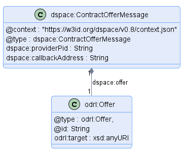
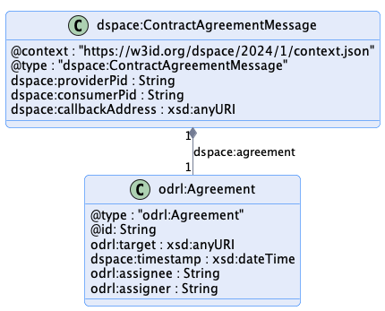
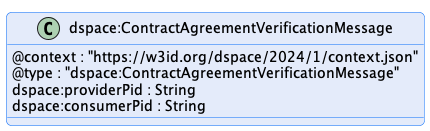
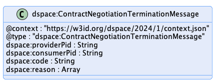
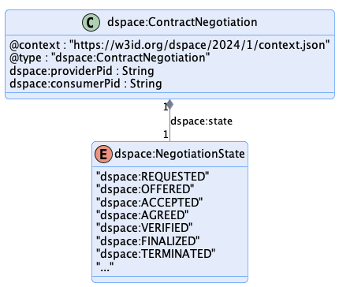

# Contract Negotiation Protocol

This document outlines the key elements of the [Contract Negotiation Protocol](../model/terminology.md#contract-negotiation-protocol). The used terms are described [here](../model/terminology.md).

- [Contract Negotiation Protocol](#contract-negotiation-protocol)
  - [1 Introduction](#1-introduction)
    - [1.1 States](#11-states)
    - [1.2 State Machine](#12-state-machine)
  - [2 Message Types](#2-message-types)
    - [2.1 Contract Request Message](#21-contract-request-message)
    - [2.2 Contract Offer Message](#22-contract-offer-message)
    - [2.3 Contract Agreement Message](#23-contract-agreement-message)
    - [2.4 Contract Agreement Verification Message](#24-contract-agreement-verification-message)
    - [2.5 Contract Negotiation Event Message](#25-contract-negotiation-event-message)
    - [2.6 Contract Negotiation Termination Message](#26-contract-negotiation-termination-message)
  - [3 Response Types](#3-response-types)
    - [3.1 ACK - Contract Negotiation](#31-ack---contract-negotiation)
    - [3.2 ERROR - Contract Negotiation Error](#32-error---contract-negotiation-error)

## 1 Introduction

A [Contract Negotiation](../model/terminology.md#contract-negotiation) (CN) involves two parties, a [Provider](../model/terminology.md#provider) that offers one or more [Datasets](../model/terminology.md#dataset) under a usage contract and [Consumer](../model/terminology.md#consumer) that requests [Datasets](../model/terminology.md#dataset). A CN is uniquely identified through an [IRI](https://www.w3.org/International/articles/idn-and-iri/). Each CN requires a newly generated IRI, which may not be used in a CN after a terminal state has been reached. A CN progresses through a series of states, which are tracked by the [Provider](../model/terminology.md#provider) and [Consumer](../model/terminology.md#consumer) using messages. A CN transitions to a state in response to an acknowledged message from the counter-party. Both parties have the same state of the CN. In case the states differ, the CN is terminated and a new CN has to be initiated.

### 1.1 States

The CN states are:

- **REQUESTED**: A contract for a [Dataset](../model/terminology.md#dataset) has been requested by the [Consumer](../model/terminology.md#consumer) based on an [Offer](../model/terminology.md#offer) and the [Provider](../model/terminology.md#provider) has sent an ACK response.
- **OFFERED**: The [Provider](../model/terminology.md#provider) has sent an [Offer](../model/terminology.md#offer) to the [Consumer](../model/terminology.md#consumer) and the [Consumer](../model/terminology.md#consumer) has sent an ACK response.
- **ACCEPTED**: The [Consumer](../model/terminology.md#consumer) has accepted the latest [Offer](../model/terminology.md#offer) and the [Provider](../model/terminology.md#provider) has sent an ACK response.
- **AGREED**: The [Provider](../model/terminology.md#provider) has accepted the latest [Offer](../model/terminology.md#offer), sent an [Agreement](../model/terminology.md#agreement) to the [Consumer](../model/terminology.md#consumer), and the [Consumer](../model/terminology.md#consumer) has sent an ACK response.
- **VERIFIED**: The [Consumer](../model/terminology.md#consumer) has sent an [Agreement](../model/terminology.md#agreement) verification to the [Provider](../model/terminology.md#provider) and the [Provider](../model/terminology.md#provider) has sent an ACK response.
- **FINALIZED**: The [Provider](../model/terminology.md#provider) has sent a finalization message including his own [Agreement](../model/terminology.md#agreement) verification to the [Consumer](../model/terminology.md#consumer) and the [Consumer](../model/terminology.md#consumer) has sent an ACK response. Data is now available to the [Consumer](../model/terminology.md#consumer).
- **TERMINATED**: The [Provider](../model/terminology.md#provider) or [Consumer](../model/terminology.md#consumer) has placed the CN in a terminated state. A termination message has been sent by either of the [Participants](../model/terminology.md#participant) and the other has sent an ACK response. This is a terminal state.

### 1.2 State Machine

The CN state machine is represented in the following diagram:

Transitions marked with `C` indicate a message sent by the [Consumer](../model/terminology.md#consumer), transitions marked with `P` indicate a [Provider](../model/terminology.md#provider) message. Terminal states are final; the state machine may not transition to another state. A new CN may be initiated if, for instance, the CN entered the `TERMINATED` state due to a network issue.

## 2 Message Types

The CN state machine is transitioned upon receipt and acknowledgement of a message. This section details those messages as abstract message types.

- Concrete wire formats are defined by the protocol binding, e.g., [Contract Negotiation HTTPS Binding](contract.negotiation.binding.https.md)..
- All [Policy](../model/terminology.md#policy) types ([Offer](../model/terminology.md#offer), [Agreement](../model/terminology.md#agreement)) must contain an unique identifier in the form of a URI. GUIDs can also be used in the form of URNs, for instance following the pattern <urn:uuid:{GUID}>.
- An [ODRL Agreement](https://www.w3.org/TR/odrl-vocab/#term-Agreement) must have a target property containing the [Dataset](../model/terminology.md#dataset) id.

### 2.1 Contract Request Message

|                     |                                                                                                                                         |
|---------------------|-----------------------------------------------------------------------------------------------------------------------------------------|
| **Sent by**         | [Consumer](../model/terminology.md#consumer)                                                                                            |
| **Resulting state** | `REQUESTED`, `TERMINATED`                                                                                                               |
| **Response**        | [ACK](#31-ack---contract-negotiation) or [ERROR](#32-error---contract-negotiation-error)                                                |
| **Schema**          | [TTL Shape](./message/shape/contract-request-message-shape.ttl), [JSON Schema](./message/schema/contract-request-message-schema.json)   |
| **Example**         | Initiating [Message](./message/example/contract-request-message_initial.json), [Message](./message/example/contract-offer-message.json) |
| **Diagram(s)**      |                                                                                      |

The Contract Request Message is sent by a [Consumer](../model/terminology.md#consumer) to initiate a CN or to respond to a [Contract Offer Message](#22-contract-offer-message) sent by a [Provider](../model/terminology.md#provider).
- The [Consumer](../model/terminology.md#consumer) must include an `offer` property, which itself must have a `@id` property. If the message includes a `providerPid` property, the request will be associated with an existing CN and a [Consumer](../model/terminology.md#consumer) [Offer](../model/terminology.md#offer) will be created using either the `offer` or `offer.@id` properties. If the message does not include a `providerPid`, a new CN will be created on [Provider](../model/terminology.md#provider) side using either the `offer` or `offer.@id` properties and the [Provider](../model/terminology.md#provider) selects an appropriate `providerPid`.
- An `offer.@id` will generally refer to an [Offer](../model/terminology.md#offer) contained in a [Catalog](../model/terminology.md#catalog). If the [Provider](../model/terminology.md#provider) is not aware of the `offer.@id` value, it must respond with an error message.
- The `callbackAddress` is a URL indicating where messages to the [Consumer](../model/terminology.md#consumer) should be sent in asynchronous settings. If the address is not understood, the [Provider](../model/terminology.md#provider) MUST return an UNRECOVERABLE error.
- Different to a [Catalog](../model/terminology.md#catalog) or [Dataset](../model/terminology.md#dataset), the [Offer](../model/terminology.md#offer) inside a [Contract Request Message](#21-contract-request-message) must have an `odrl:target` attribute. However, it's contained Rules must not have any `odrl:target` attributes to prevent inconsistencies with the [ODRL inferencing rules for compact policies](https://www.w3.org/TR/odrl-model/#composition-compact).

### 2.2 Contract Offer Message

|                     |                                                                                                                                                    |
|---------------------|----------------------------------------------------------------------------------------------------------------------------------------------------|
| **Sent by**         | [Provider](../model/terminology.md#provider)                                                                                                       |
| **Resulting state** | `OFFERED`, `TERMINATED`                                                                                                                            |
| **Response**        | [ACK](#31-ack---contract-negotiation) or [ERROR](#32-error---contract-negotiation-error)                                                           |
| **Schema**          | [TTL Shape](./message/shape/contract-offer-message-shape.ttl), [JSON Schema](./message/schema/contract-offer-message-schema.json)                  |
| **Example**         | [Example Initial Message](./message/example/contract-offer-message_initial.json), [Example Message](./message/example/contract-offer-message.json) |
| **Diagram(s)**      | 
Initial message (note the missing `consumerPid`) 
 
 
 
 
 Message following a [Contract Request Message](#21-contract-request-message):
 
      
                                |

The Contract Offer Message is sent by a [Provider](../model/terminology.md#provider) to initiate a CN or to respond to a [Contract Request Message](#21-contract-request-message) sent by a [Consumer](../model/terminology.md#consumer).
- If the message includes a `consumerPid` property, the request will be associated with an existing CN. If the message does not include a `consumerPid`, a new CN will be created on [Consumer](../model/terminology.md#consumer) side and the [Consumer](../model/terminology.md#consumer) selects an appropriate `consumerPid`.
- The [Dataset](../model/terminology.md#dataset) id is not required but can be included when the [Provider](../model/terminology.md#provider) initiates a CN.
- Different to a [Dataset](../model/terminology.md#dataset) (see [DCAT Vocabulry Mapping](../catalog/catalog.protocol.md#11-dcat-vocabulary-mapping)), the Offer inside a ContractOfferMessage must have an `odrl:target` attribute. However, it's contained Rules must not have any `odrl:target` attributes to prevent inconsistencies with the [ODRL inferencing rules for compact policies](https://www.w3.org/TR/odrl-model/#composition-compact).

### 2.3 Contract Agreement Message

|                     |                                                                                                                                           |
|---------------------|-------------------------------------------------------------------------------------------------------------------------------------------|
| **Sent by**         | [Provider](../model/terminology.md#provider)                                                                                              |
| **Resulting state** | `AGREED`, `TERMINATED`                                                                                                                    |
| **Response**        | [ACK](#31-ack---contract-negotiation) or [ERROR](#32-error---contract-negotiation-error)                                                  |
| **Schema**          | [TTL Shape](./message/shape/contract-agreement-message-shape.ttl), [JSON Schema](./message/schema/contract-agreement-message-schema.json) |
| **Example**         | [Message](./message/example/contract-agreement-message.json)                                                                              |
| **Diagram(s)**      |                                                                                      |

The Contract Agreement Message is sent by a [Provider](../model/terminology.md#provider) when it agrees to a contract. It contains the complete [Agreement](../model/terminology.md#agreement).
- The message must contain a `consumerPid` and a `providerPid`.
- The message must contain an [ODRL Agreement](https://www.w3.org/TR/odrl-vocab/#term-Agreement).
- An [Agreement](../model/terminology.md#agreement) must contain a `timestamp` property defined as an [XSD DateTime](https://www.w3schools.com/XML/schema_dtypes_date.asp) type.
- An [Agreement](../model/terminology.md#agreement) must contain an `assigner` and `assignee`. The contents of these properties are a dataspace-specific unique identifier of the [Agreement](../model/terminology.md#agreement) parties. Note that these identifiers are not necessarily the same as the identifiers of the [Participant Agents](../model/terminology.md#participant-agent) negotiating the contract (e.g., [Connectors](../model/terminology.md#connector--data-service-)).
- An [Agreement](../model/terminology.md#agreement) must contain a `odrl:target` property. None of its Rules, however, must have any `odrl:target` attributes to prevent inconsistencies with the [ODRL inferencing rules for compact policies](https://www.w3.org/TR/odrl-model/#composition-compact).

### 2.4 Contract Agreement Verification Message

|                     |                                                                                                                                                                     |
|---------------------|---------------------------------------------------------------------------------------------------------------------------------------------------------------------|
| **Sent by**         | [Consumer](../model/terminology.md#consumer)                                                                                                                        |
| **Resulting state** | `VERIFIED`, `TERMINATED`                                                                                                                                            |
| **Response**        | [ACK](#31-ack---contract-negotiation) or [ERROR](#32-error---contract-negotiation-error)                                                                            |
| **Schema**          | [TTL Shape](./message/shape/contract-agreement-verification-message-shape.ttl), [JSON Schema](./message/schema/contract-agreement-verification-message-schema.json) |
| **Example**         | [Message](./message/example/contract-agreement-verification-message.json)                                                                                           |
| **Diagram(s)**      |                                                                                                   |

The Contract Agreement Verification Message is sent by a [Consumer](../model/terminology.md#consumer) to verify the acceptance of an [Agreement](../model/terminology.md#agreement).
- A [Provider](../model/terminology.md#provider) responds with an error if the contract cannot be validated or is incorrect.
- The message must contain a `consumerPid` and a `providerPid`.

### 2.5 Contract Negotiation Event Message

|                     |                                                                                                                                                           |
|---------------------|-----------------------------------------------------------------------------------------------------------------------------------------------------------|
| **Sent by**         | [Consumer](../model/terminology.md#consumer), [Provider](../model/terminology.md#provider)                                                                |
| **Resulting state** | `FINALIZED`, `ACCEPTED`, `TERMINATED`                                                                                                                     |
| **Response**        | [ACK](#31-ack---contract-negotiation) or [ERROR](#32-error---contract-negotiation-error)                                                                  |
| **Schema**          | [TTL Shape](./message/shape/contract-negotiation-event-message-shape.ttl), [JSON Schema](./message/schema/contract-negotiation-event-message-schema.json) |
| **Example**         | [Message](./message/example/contract-negotiation-event-message.json)                                                                                      |
| **Diagram(s)**      |                                                                                              |

When the Contract Negotiation Event Message is sent by a [Provider](../model/terminology.md#provider) with an `eventType` property set to `FINALIZED`, an [Agreement](../model/terminology.md#agreement) has been finalized and the associated [Dataset](../model/terminology.md#dataset) is accessible. The state machine is transitioned to the `FINALIZED` state.
- Other event types may be defined in the future. 
- A [Consumer](../model/terminology.md#consumer) responds with an error if the contract cannot be validated or is incorrect.
- The message must contain a `consumerPid` and a `providerPid`.
- When the message is sent by a [Consumer](../model/terminology.md#consumer) with an `eventType` set to `ACCEPTED`, the state machine is placed in the `ACCEPTED` state.
- It is an error for a [Consumer](../model/terminology.md#consumer) to send the message with an event type `FINALIZED` to the [Provider](../model/terminology.md#provider).
- It is an error for a [Provider](../model/terminology.md#provider) to send the message with an event type `ACCEPTED` to the [Consumer](../model/terminology.md#consumer).

Note that CN events are not intended for propagation of an [Agreement](../model/terminology.md#agreement) state after a CN has entered a terminal state. It is considered an error for a [Consumer](../model/terminology.md#consumer) or [Provider](../model/terminology.md#provider) to send an event after the CN state machine has entered a terminal state.

### 2.6 Contract Negotiation Termination Message

|                     |                                                                                                                                                                       |
|---------------------|-----------------------------------------------------------------------------------------------------------------------------------------------------------------------|
| **Sent by**         | [Consumer](../model/terminology.md#consumer), [Provider](../model/terminology.md#provider)                                                                            |
| **Resulting state** | `TERMINATED`                                                                                                                                                          |
| **Response**        | [ACK](#31-ack---contract-negotiation) or [ERROR](#32-error---contract-negotiation-error)                                                                              |
| **Schema**          | [TTL Shape](./message/shape/contract-negotiation-termination-message-shape.ttl), [JSON Schema](./message/schema/contract-negotiation-termination-message-schema.json) |
| **Example**         | [Message](./message/example/contract-negotiation-termination-message.json)                                                                                            |
| **Diagram(s)**      |                                                                                                    |

The Contract Negotiation Termination Message is sent by a [Consumer](../model/terminology.md#consumer) or [Provider](../model/terminology.md#provider) indicating it has cancelled the CN sequence. The message can be sent at any state of a CN without providing an explanation. Nevertheless, the sender may provide a description to help the receiver. 
- The message must contain a `consumerPid` and a `providerPid`.
- If an error is received in response to the message, the sending party may choose to ignore the error.

Note that a CN may be terminated for a variety of reasons, for example, an unrecoverable error was encountered or one of the parties no longer wishes to continue. A [Connector's](../model/terminology.md#connector--data-service-) operator may remove terminated CN resources after it has reached the terminated state.

## 3 Response Types

The `ACK` and `ERROR` response types are mapped onto a protocol such as HTTPS. A description of an error might be provided in protocol-dependent forms, e.g., for an HTTPS binding in the request or response body.

### 3.1 ACK - Contract Negotiation

|                 |                                                                                                                               |
|-----------------|-------------------------------------------------------------------------------------------------------------------------------|
| **Sent by**     | [Consumer](../model/terminology.md#consumer), [Provider](../model/terminology.md#provider)                                    |
| **Schema**      | [TTL Shape](./message/shape/contract-negotiation-shape.ttl), [JSON Schema](./message/schema/contract-negotiation-schema.json) |
| **Example**     | [Process](./message/example/contract-negotiation.json)                                                                        |
| **Diagram(s)**  |                                                                                |

The Contract Negotiation is an object returned by a [Consumer](../model/terminology.md#consumer) or [Provider](../model/terminology.md#provider) indicating a successful state change happened.

### 3.2 ERROR - Contract Negotiation Error

|                 |                                                                                                                                           |
|-----------------|-------------------------------------------------------------------------------------------------------------------------------------------|
| **Sent by**     | [Consumer](../model/terminology.md#consumer), [Provider](../model/terminology.md#provider)                                                |
| **Schema**      | [TTL Shape](./message/shape/contract-negotiation-error-shape.ttl), [JSON Schema](./message/schema/contract-negotiation-error-schema.json) |
| **Example**     | [Error](./message/example/contract-negotiation-error.json)                                                                                |
| **Diagram(s)**  |                                                                                      |

The Contract Negotiation Error is an object returned by a [Consumer](../model/terminology.md#consumer) or [Provider](../model/terminology.md#provider) indicating an error has occurred. It does not cause a state transition.

| Field         | Type          | Description                                                            |
|---------------|---------------|------------------------------------------------------------------------|
| `consumerPid` | UUID          | The CN unique id on [Consumer](../model/terminology.md#consumer) side. |
| `providerPid` | UUID          | The CN unique id on [Provider](../model/terminology.md#provider) side. |
| `code`        | String        | An optional implementation-specific error code.                        |
| `reason`      | Array[object] | An optional array of implementation-specific error objects.            |
