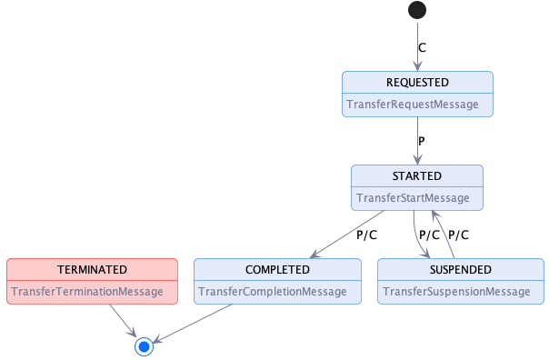

# Transfer Process Protocol

## Introduction: Terms

This document outlines the key elements of the transfer process protocol. The following terms are used:

- A _**message type**_ defines the structure of a _message_.
- A _**message**_  is an instantiation of a _message type_.
- The _**transfer process protocol**_ is the set of allowable message type sequences and is defined as a state machine (TP-SM).
- A _**transfer process (TP)**_ is an instantiation of the CNP-TP.
- A _**provider**_ is a participant agent that offers an asset.
- A _**consumer**_ is a participant agent that requests access to an offered asset.
- A _**Connector**_ is a `PariticipantAgent` that produces `Agreements` and manages `Asset` sharing.
- An _**Asset**_ is data or a service a provider grants access to.
- An _**Agreement**_ is a result of a [Contract Negotiation](../negotiation/contract.negotiation.protocol.md) and is associated with _exactly one_ `Asset`.

## Transfer Process  Protocol

A transfer process (TP) involves two parties, a _provider_ that offers one or more assets under a usage policy and _consumer_ that requests assets. A TP progresses through
a series of states, which are tracked by the provider and consumer using messages. A TP transitions to a state in response to a message from the counter-party.

### Connector Components: Control and Data Planes

A TP is managed by a `Connector`. The connector consists of two logical components, a `Control Plane` and a `Data Plane`. The control plane serves as a coordinating layer that
receives counter-party messages and manages the TP state. The data plane performs the actual transfer of asset data using a wire protocol. Both participants run control and data
planes.

It is important to note that the control and data planes are logical constructs. Implementations may choose to deploy both components within a single process or across
heterogeneous
clusters.

### Asset Transfer Types

Asset transfers are characterized as `push` or `pull` transfers and asset data is either `finite` or `non-finite`. This section describes the difference between these types.

#### Push Transfer

A push transfer is when the producer data plane initiates sending of asset data to a consumer endpoint. For example, after the consumer has issued an `TransferRequestMessage,` the
producer begins data transmission to an endpoint specified by the consumer using an agreed-upon wire protocol.

<< Include example diagram >>

#### Pull Transfer

A pull transfer is when the consumer data plane initiates retrieval of asset data from a producer endpoint. For example, after the consumer has issued an `TransferProcessStart,`
message, the consumer requests the data from the producer-specified endpoint.

<< Include example diagram >>

#### Finite and Non-Finite Asset Data

Asset data may be `finite` or `non-finite.` Finite data is data that is defined by a finite set, for example, machine learning data or images . After finite data transmission has
finished, the transfer process is completed. Non-finite data is data that is defined by an infinite set or has no specified end, for example streams or an API endpoint. With
non-finite data, a TP will continue indefinitely until either the consumer or provider explicitly terminates the transmission.

### Transfer Process States

The TP states are:

- **REQUESTED** - An asset has been requested under an `Agreement` by the consumer and the provider has sent an ACK response.
- **STARTED** - The asset is available for access by the consumer or the producer has begun pushing the asset to the consumer endpoint.
- **COMPLETED** - The transfer has been completed by either the consumer or the producer.
- **SUSPENDED** - The transfer has been suspended by the consumer or the producer.
- **TERMINATED** - The transfer process has been terminated by the consumer or the producer.

### Transfer Process State Machine

## Message Types

### 1. TransferRequestMessage

**Sent by**: Consumer

**Resulting State**: REQUESTED

**Example**: [TransferRequestMessage](./message/transfer.request.message.json)

**Response**: [TransferProcess](./message/transfer.process.json) containing the transfer process id or ERROR.

**Schema**: (xx)[]

#### Description

The _TransferRequestMessage_ is sent by a consumer to initiate a transfer process.

#### Notes

- The `agreementId` property refers to an existing contract agreement between the consumer and provider.
- The `dct:format` property is a format specified by a `Distribution` for the `Asset` associated with the agreement. This is generally obtained from the provider `Catalog`.
- The `dataAddress` property must only be provided if the `dct:format` requires a push transfer.
- `callbackAddress` is a URI indicating where messages to the consumer should be sent. If the address is not understood, the provider MUST return an UNRECOVERABLE error.

Providers should implement idempotent behavior for TransferRequestMessage based on the value of `@id`. Providers may choose to implement idempotent behavior for a certain period of
time. For example, until a transfer processes has completed and been archived after an implementation-specific expiration period. If a request for the given `@id` has already been
received *and* the same consumer sent the original message, the provider should respond with an appropriate _DataAddressMessage_.

Once a transfer process have been created, all associated callback messages must include a `correlationId` set to the _TransferRequestMessage_ `@id` value.

Providers must include a `correlationId` property in the `TransferProcessMessage` with a value set to the `@id` of the corresponding _TransferRequestMessage_

#### Notes

- The 'dataAddress' contains a transport-specific endpoint address for pushing the asset. It may include a temporary authorization token.

### 2. TransferStartMessage

**Sent by**: Provider

**Resulting State**: STARTED

**Example**: [TransferStartMessage](./message/transfer.start.message.json)

**Response**: ACK or ERROR.

**Schema**: (xx)[]

#### Description

The _TransferStartMessage_ is sent by the provider to indicate the asset transfer has been initiated.

#### Notes

- The 'dataAddress' is only provided if the current transfer is a pull transfer and contains a transport-specific endpoint address for obtaining the asset. It may include a
  temporary authorization token.

### 3. TransferCompletionMessage

#### Description

The _TransferCompletionMessage_ is sent by the provider or consumer when asset transfer has completed. Note that some data plane implementations may optimize completion
notification by performing it as part of its wire protocol. In those cases, a _TransferCompletionMessage_ message does not need to be sent.

### 4. TransferTerminationMessage

#### Description

The _TransferTerminationMessage_ is sent by the provider or consumer at any point except a terminal state to indicate the data transfer process should stop and be placed in
a terminal state. If the termination was due to an error, the sender may include error information. 
