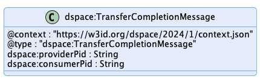

# Transfer Process Protocol

## Introduction: Terms

This document outlines the key elements of the Transfer Process Protocol. The following terms are used:

- A _**message type**_ defines the structure of a _message_.
- A _**message**_  is an instantiation of a _message type_.
- The _**transfer process protocol**_ is the set of allowable message type sequences and is defined as a state machine (TP-SM).
- A _**transfer process (TP)**_ is an instantiation of the CNP-TP.
- A _**provider**_ is a [Participant Agent](../model/terminology.md#participant-agent) that offers a [Dataset](../model/terminology.md#dataset).
- A _**consumer**_ is a [Participant Agent](../model/terminology.md#participant-agent) that requests access to an offered [Dataset](../model/terminology.md#dataset).
- A _**Connector**_ is a [Participant Agent](../model/terminology.md#participant-agent) that produces [Agreements](../model/terminology.md#agreement) and manages [Dataset](../model/terminology.md#dataset) sharing.
- A _**Dataset**_ is data or a service a provider grants access to.
- An _**Agreement**_ is a result of a [Contract Negotiation](../negotiation/contract.negotiation.protocol.md) and is associated with _exactly one_ [Dataset](../model/terminology.md#dataset).

## Transfer Process Protocol

A [Transfer Process](../model/terminology.md#transfer-process) (TP) involves two parties, a _provider_ that offers one or more [Datasets](../model/terminology.md#dataset) under a [Usage Policy](../model/terminology.md#policy) and _consumer_ that requests [Datasets](../model/terminology.md#dataset). A TP progresses through
a series of states, which are tracked by the provider and consumer using messages. A TP transitions to a state in response to a message from the counter-party.

### Connector Components: Control and Data Planes

A TP is managed by a [Connector](../model/terminology.md#connector--data-service-). The [Connector](../model/terminology.md#connector--data-service-) consists of two logical components, a `Control Plane` and a `Data Plane`. The control plane serves as a coordinating layer that
receives counter-party messages and manages the TP state. The data plane performs the actual transfer of data using a wire protocol. Both [Participants](../model/terminology.md#participant) run control and data
planes.

It is important to note that the control and data planes are logical constructs. Implementations may choose to deploy both components within a single process or across
heterogeneous clusters.

### Dataset Transfer Types

[Dataset](../model/terminology.md#dataset) transfers are characterized as `push` or `pull` transfers and it's data is either `finite` or `non-finite`. This section describes the difference between these types.

#### Push Transfer

A push transfer is when the provider data plane initiates sending of data to a consumer endpoint. For example, after the consumer has issued an `TransferRequestMessage,` the
provider begins data transmission to an endpoint specified by the consumer using an agreed-upon wire protocol.

#### Pull Transfer

A pull transfer is when the consumer data plane initiates retrieval of data from a provider endpoint. For example, after the provider has issued an `TransferProcessStart,`
message, the consumer can request the data from the provider-specified endpoint.

#### Finite and Non-Finite Data

Data may be `finite` or `non-finite.` Finite data is data that is defined by a finite set, for example, machine learning data or images. After finite data transmission has
finished, the [Transfer Process](../model/terminology.md#transfer-process) is completed. Non-finite data is data that is defined by an infinite set or has no specified end, for example streams or an API endpoint. With
non-finite data, a TP will continue indefinitely until either the consumer or provider explicitly terminates the transmission.

### Transfer Process States

The TP states are:

- **REQUESTED** - A [Dataset](../model/terminology.md#dataset) has been requested under an [Agreement](../model/terminology.md#agreement) by the consumer and the provider has sent an ACK response.
- **STARTED** - The [Dataset](../model/terminology.md#dataset) is available for access by the consumer or the provider has begun pushing the data to the consumer endpoint.
- **COMPLETED** - The transfer has been completed by either the consumer or the provider.
- **SUSPENDED** - The transfer has been suspended by the consumer or the provider.
- **TERMINATED** - The [Transfer Process](../model/terminology.md#transfer-process) has been terminated by the consumer or the provider.

### Transfer Process State Machine

## Message Types

### 1. TransferRequestMessage

**Sent by**: Consumer

**Resulting State**: REQUESTED

**Example**: [TransferRequestMessage](./message/transfer-request-message.json)

**Response**: [ACK or ERROR.](#response-types)

**Schema**: [TransferRequestMessage](./message/shape/transfer-request-message-shape.ttl), [TransferRequestMessage JSON Schema](./message/schema/transfer-request-message-schema.json), [TransferProcess Shape](./message/shape/transfer-process-shape.ttl) and the [TransferProcess JSON Schema](./message/schema/transfer-process-schema.json)

#### Description

The `TransferRequestMessage` is sent by a consumer to initiate a [Transfer Process](../model/terminology.md#transfer-process).

#### Notes

- The `consumerPid` property refers to the transfer id on consumer side.
- The `agreementId` property refers to an existing [Agreement](../model/terminology.md#agreement) between the consumer and provider.
- The `dct:format` property is a format specified by a `Distribution` for the [Dataset](../model/terminology.md#dataset) associated with the [Agreement](../model/terminology.md#agreement). This is generally obtained from the provider [Catalog](../model/terminology.md#catalog).
- The `dataAddress` property must only be provided if the `dct:format` requires a push transfer.
- `callbackAddress` is a URI indicating where messages to the consumer should be sent. If the address is not understood, the provider MUST return an UNRECOVERABLE error.

Providers should implement idempotent behavior for `TransferRequestMessage` based on the value of `dspace:consumerPid`. Providers may choose to implement idempotent behavior for a certain period of
time. For example, until a [Transfer Process](../model/terminology.md#transfer-process) has completed and been archived after an implementation-specific expiration period. If a request for the given `dspace:consumerPid` has already been
received *and* the same consumer sent the original message, the provider should respond with an appropriate `DataAddressMessage`.

Once a [Transfer Process](../model/terminology.md#transfer-process) have been created, all associated callback messages must include a `dspace:consumerPid` and `dspace:providerPid`.

Providers must include a `dspace:consumerPid` and a `dspace:providerPid` property in the `TransferProcess`.

- The `dataAddress` contains a transport-specific endpoint address for pushing the data. It may include a temporary authorization via the `dspace:endpointProperties` property.
- Valid states of a `TransferProcess` are `REQUESTED`, `STARTED`, `TERMINATED`, `COMPLETED`, and `SUSPENDED`.

### 2. TransferStartMessage

**Sent by**: Provider

**Resulting State**: STARTED

**Example**: [TransferStartMessage](./message/transfer-start-message.json)

**Response**: [ACK or ERROR.](#response-types)

**Schema**: [TransferStartMessageShape](./message/shape/transfer-start-message-shape.ttl) and the [TransferStartMessage JSON Schema](./message/schema/transfer-start-message-schema.json)

#### Description

The `TransferStartMessage` is sent by the provider to indicate the [Dataset](../model/terminology.md#dataset) transfer has been initiated.

#### Notes

- The `dataAddress` is only provided if the current transfer is a pull transfer and contains a transport-specific endpoint address for obtaining the [Dataset](../model/terminology.md#dataset). It may include a temporary authorization via the `dspace:endpointProperties` property.

### 3. TransferSuspensionMessage

**Sent by**: Provider or Consumer

**Resulting State**: SUSPENDED

**Example**: [TransferSuspensionMessage](./message/transfer-suspension-message.json)

**Response**: [ACK or ERROR.](#response-types)

**Schema**: [TransferSuspensionMessageShape](./message/shape/transfer-suspension-message-shape.ttl) and the [TransferSuspensionMessage JSON Schema](./message/schema/transfer-suspension-message-schema.json)

#### Description

The `TransferSuspensionMessage` is sent by the provider or consumer when either of them needs to temporarily suspend the [Transfer Process](../model/terminology.md#transfer-process).

### 4. TransferCompletionMessage

**Sent by**: Provider or Consumer

**Resulting State**: COMPLETED

**Example**: [TransferCompletionMessage](./message/transfer-completion-message.json)

**Response**: [ACK or ERROR.](#response-types)

**Schema**: [TransferCompletionMessageShape](./message/shape/transfer-completion-message-shape.ttl) and the [TransferCompletionMessage JSON Schema](./message/schema/transfer-completion-message-schema.json)

#### Description

The `TransferCompletionMessage` is sent by the provider or consumer when a [Dataset](../model/terminology.md#dataset) transfer has completed. Note that some data plane implementations may optimize completion
notification by performing it as part of its wire protocol. In those cases, a `TransferCompletionMessage` message does not need to be sent.

### 5. TransferTerminationMessage

**Sent by**: Provider or Consumer

**Resulting State**: TERMINATED

**Example**: [TransferTerminationMessage](./message/transfer-termination-message.json)

**Response**: [ACK or ERROR.](#response-types)

**Schema**: [TransferTerminationMessageShape](./message/shape/transfer-termination-message-shape.ttl) and the [TransferTerminationMessage JSON Schema](./message/schema/transfer-termination-message-schema.json)

#### Description

The `TransferTerminationMessage` is sent by the provider or consumer at any point except a terminal state to indicate the [Transfer Process](../model/terminology.md#transfer-process) should stop and be placed in
a terminal state. If the termination was due to an error, the sender may include error information.

## Response Types

### ACK - TransferProcess

**Example**: [TransferProcess](./message/transfer-process.json)

**Schema**: [TransferProcessShape](./message/shape/transfer-process-shape.ttl) and the [TransferProcess JSON Schema](./message/schema/transfer-process-schema.json)

#### Description

The `TransferProcess` is an object returned by a consumer or provider indicating a successful state change happened.

### ERROR - TransferError

**Example**: [TransferError](./message/transfer-error.json)

**Schema**: [TransferErrorShape](./message/shape/transfer-error-shape.ttl) and the [TransferError JSON Schema](./message/schema/transfer-error-schema.json)

#### Description

The `TransferError` is an object returned by a consumer or provider indicating an error has occurred. It does not cause a state transition.
