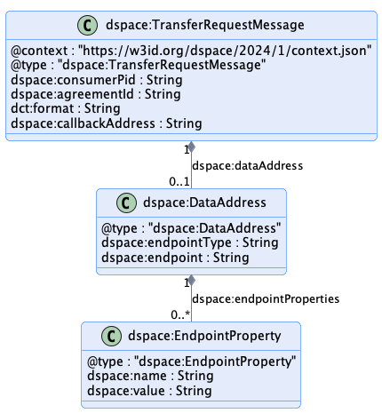

# Transfer Process Protocol

## 1 Introduction: Terms

This document outlines the key elements of the transfer process protocol. In additiation to the generally defined [concepts](../model/terminology.md), the following terms are used:

- The _**transfer process protocol**_ is the set of allowable message type sequences and is defined as a state machine.
- A _**transfer process (TP)**_ contains all steps necessary to transfer an [Dataset](../model/terminology.md#dataset) from the [Provider](../model/terminology.md#provider) to the [Consumer](../model/terminology.md#consumer).

## 2 Transfer Process Protocol

A [Transfer Process](../model/terminology.md#transfer-process) involves two parties, a [Provider](../model/terminology.md#provider) that offers one or more [Datasets](../model/terminology.md#dataset) under a [Usage Policy](../model/terminology.md#policy) and [Consumer](../model/terminology.md#consumer) that requests [Datasets](../model/terminology.md#dataset). A TP progresses through
a series of states, which are controlled by the [Provider](../model/terminology.md#provider) and [Consumer](../model/terminology.md#consumer) using messages. A TP transitions to another state as a result of an exchanged message.

A TP is managed by a [Connector](../model/terminology.md#connector--data-service-). The [Connector](../model/terminology.md#connector--data-service-) serves as a coordinating technical entity that
receives counter-party messages and manages its local state of the TP. It may as well also operate the hosting of the [Datasets](../model/terminology.md#dataset), or control their offering through another system.

### 2.1 Connector Components: Control and Data Planes
A TP is managed by a [Connector](../model/terminology.md#connector--data-service-). The [Connector](../model/terminology.md#connector--data-service-) consists of two logical components, a `Control Plane` and a `Data Plane`. The control plane serves as a coordinating layer that
receives counter-party messages and manages the TP state. The data plane performs the actual transfer of [Datasets](../model/terminology.md#dataset) using a wire protocol. Both participants run control and data
planes.

It is important to note that the control and data planes are logical constructs. Implementations may choose to deploy both components within a single process or across
heterogeneous clusters.

### 2.2 Dataset Transfer Types

[Dataset](../model/terminology.md#dataset) transfers are characterized as `push` or `pull` transfers and it's data is either `finite` or `non-finite`. This section describes the difference between these types.

#### Push Transfer

A push transfer is when the [Provider's](../model/terminology.md#provider) data plane initiates sending of data to a [Consumer](../model/terminology.md#consumer) endpoint. For example, after the [Consumer](../model/terminology.md#consumer) has issued an `TransferRequestMessage,` the
[Provider](../model/terminology.md#provider) begins data transmission to an endpoint specified by the [Consumer](../model/terminology.md#consumer) using an agreed-upon wire protocol.

#### Pull Transfer

A pull transfer is when the [Consumer](../model/terminology.md#consumer) data plane initiates retrieval of data from a [Provider](../model/terminology.md#provider) endpoint. For example, after the [Provider](../model/terminology.md#provider) has issued an `TransferProcessStart,`
message, the [Consumer](../model/terminology.md#consumer) can request the data from the [Provider](../model/terminology.md#provider)-specified endpoint.

#### Finite and Non-Finite Data

Data may be `finite` or `non-finite.` Finite data is data that is defined by a finite set, for example, machine learning data or images. After finite data transmission has
finished, the [Transfer Process](../model/terminology.md#transfer-process) is completed. Non-finite data is data that is defined by an infinite set or has no specified end, for example streams or an API endpoint. With
non-finite data, a TP will continue indefinitely until either the [Consumer](../model/terminology.md#consumer) or [Provider](../model/terminology.md#provider) explicitly terminates the transmission.

### 2.3 Transfer Process States

The TP states are:

- **REQUESTED** - A [Dataset](../model/terminology.md#dataset) has been requested under an [Agreement](../model/terminology.md#agreement) by the [Consumer](../model/terminology.md#consumer) and the [Provider](../model/terminology.md#provider) has sent an ACK response.
- **STARTED** - The [Dataset](../model/terminology.md#dataset) is available for access by the [Consumer](../model/terminology.md#consumer) or the [Provider](../model/terminology.md#provider) has begun pushing the data to the [Consumer](../model/terminology.md#consumer) endpoint.
- **COMPLETED** - The transfer has been completed by either the [Consumer](../model/terminology.md#consumer) or the [Provider](../model/terminology.md#provider).
- **SUSPENDED** - The transfer has been suspended by the [Consumer](../model/terminology.md#consumer) or the [Provider](../model/terminology.md#provider).
- **TERMINATED** - The [Transfer Process](../model/terminology.md#transfer-process) has been terminated by the [Consumer](../model/terminology.md#consumer) or the [Provider](../model/terminology.md#provider).

### 2.4 Transfer Process State Machine

## 3 Message Types

All messages must be serialized in JSON-LD compact form as specified in the [JSON-LD 1.1 Processing Algorithms and API](https://www.w3.org/TR/json-ld11-api/#compaction-algorithms).
Further Dataspace specifications may define additional optional serialization formats.

### 3.1 TransferRequestMessage

**Sent by**: [Consumer](../model/terminology.md#consumer)

**Resulting State**: REQUESTED

**Example**: [TransferRequestMessage](./message/transfer-request-message.json)

**Response**: [ACK or ERROR.](#response-types)

**Schema**: [TransferRequestMessage](./message/shape/transfer-request-message-shape.ttl), [TransferRequestMessage JSON Schema](./message/schema/transfer-request-message-schema.json), [TransferProcess Shape](./message/shape/transfer-process-shape.ttl) and the [TransferProcess JSON Schema](./message/schema/transfer-process-schema.json)

#### Description

The `TransferRequestMessage` is sent by a [Consumer](../model/terminology.md#consumer) to initiate a [Transfer Process](../model/terminology.md#transfer-process).

#### Notes

- The `consumerPid` property refers to the transfer id of the [Consumer](../model/terminology.md#consumer) side.
- The `agreementId` property refers to an existing contract [Agreement](../model/terminology.md#agreement) between the [Consumer](../model/terminology.md#consumer) and [Provider](../model/terminology.md#provider).
- The `dct:format` property is a format specified by a `Distribution` for the [Dataset](../model/terminology.md#dataset) associated with the [Agreement](../model/terminology.md#agreement). This is generally obtained from the [Provider's](../model/terminology.md#provider) [Catalog](../model/terminology.md#catalog).
- The `dataAddress` property must only be provided if the `dct:format` requires a push transfer.
- `callbackAddress` is a URI indicating where messages to the [Consumer](../model/terminology.md#consumer) should be sent. If the address is not understood, the [Provider](../model/terminology.md#provider) MUST return an UNRECOVERABLE error.

[Provider]s(../model/terminology.md#provider) should implement idempotent behavior for `TransferRequestMessage` based on the value of `dspace:consumerPid`. [Providers](../model/terminology.md#provider) may choose to implement idempotent behavior for a certain period of
time. For example, until a [Transfer Process](../model/terminology.md#transfer-process) has completed and been archived after an implementation-specific expiration period, repeated sending of TransferRequestMessages does not change the state of the TP. If a request for the given `dspace:consumerPid` has already been
received *and* the same [Consumer](../model/terminology.md#consumer) sent the original message again, the [Provider](../model/terminology.md#provider) should respond with an appropriate `TransferStartMessage`.

Once a [Transfer Process](../model/terminology.md#transfer-process) has been created, all associated callback messages must include a `dspace:consumerPid` and `dspace:providerPid`.

[Providers](../model/terminology.md#provider) must include a `dspace:consumerPid` and a `dspace:providerPid` property in the `TransferProcess`.

- The `dataAddress` contains a transport-specific endpoint address for pushing the data. It may include a temporary authorization via the `dspace:endpointProperties` property.
- Valid states of a `TransferProcess` are `REQUESTED`, `STARTED`, `TERMINATED`, `COMPLETED`, and `SUSPENDED`.

### 3.2 TransferStartMessage

**Sent by**: [Provider](../model/terminology.md#provider)

**Resulting State**: STARTED

**Example**: [TransferStartMessage](./message/transfer-start-message.json)

**Response**: [ACK or ERROR.](#response-types)

**Schema**: [TransferStartMessageShape](./message/shape/transfer-start-message-shape.ttl) and the [TransferStartMessage JSON Schema](./message/schema/transfer-start-message-schema.json)

#### Description

The `TransferStartMessage` is sent by the [Provider](../model/terminology.md#provider) to indicate the [Dataset](../model/terminology.md#dataset) transfer has been initiated.

#### Notes

- The `dataAddress` is only provided if the current transfer is a pull transfer and contains a transport-specific endpoint address for obtaining the [Dataset](../model/terminology.md#dataset). It may include a temporary authorization via the `dspace:endpointProperties` property.

### 3.3 TransferSuspensionMessage

**Sent by**: [Provider](../model/terminology.md#provider) or [Consumer](../model/terminology.md#consumer)

**Resulting State**: SUSPENDED

**Example**: [TransferSuspensionMessage](./message/transfer-suspension-message.json)

**Response**: [ACK or ERROR.](#response-types)

**Schema**: [TransferSuspensionMessageShape](./message/shape/transfer-suspension-message-shape.ttl) and the [TransferSuspensionMessage JSON Schema](./message/schema/transfer-suspension-message-schema.json)

#### Description

The `TransferSuspensionMessage` is sent by the [Provider](../model/terminology.md#provider) or [Consumer](../model/terminology.md#consumer) when either of them needs to temporarily suspend the [Transfer Process](../model/terminology.md#transfer-process).

### 3.4 TransferCompletionMessage

**Sent by**: [Provider](../model/terminology.md#provider) or [Consumer](../model/terminology.md#consumer)

**Resulting State**: COMPLETED

**Example**: [TransferCompletionMessage](./message/transfer-completion-message.json)

**Response**: [ACK or ERROR.](#response-types)

**Schema**: [TransferCompletionMessageShape](./message/shape/transfer-completion-message-shape.ttl) and the [TransferCompletionMessage JSON Schema](./message/schema/transfer-completion-message-schema.json)

#### Description

The `TransferCompletionMessage` is sent by the [Provider](../model/terminology.md#provider) or [Consumer](../model/terminology.md#consumer) when a data transfer has completed. Note that some connector implementations may optimize completion
notification by performing it as part of their wire protocol. In those cases, a `TransferCompletionMessage` message does not need to be sent.

### 3.5 TransferTerminationMessage

**Sent by**: [Provider](../model/terminology.md#provider) or [Consumer](../model/terminology.md#consumer)

**Resulting State**: TERMINATED

**Example**: [TransferTerminationMessage](./message/transfer-termination-message.json)

**Response**: [ACK or ERROR.](#response-types)

**Schema**: [TransferTerminationMessageShape](./message/shape/transfer-termination-message-shape.ttl) and the [TransferTerminationMessage JSON Schema](./message/schema/transfer-termination-message-schema.json)

#### Description

The `TransferTerminationMessage` is sent by the [Provider](../model/terminology.md#provider) or [Consumer](../model/terminology.md#consumer) at any point except a terminal state to indicate the [Transfer Process](../model/terminology.md#transfer-process) should stop and be placed in
a terminal state. If the termination was due to an error, the sender may include error information.

## 4 Response Types

### 4.1 ACK - TransferProcess

**Example**: [TransferProcess](./message/transfer-process.json)

**Schema**: [TransferProcessShape](./message/shape/transfer-process-shape.ttl) and the [TransferProcess JSON Schema](./message/schema/transfer-process-schema.json)

#### Description

The `TransferProcess` is an object returned by a [Consumer](../model/terminology.md#consumer) or [Provider](../model/terminology.md#provider) indicating a successful state change happened.

### 4.2 ERROR - TransferError

**Example**: [TransferError](./message/transfer-error.json)

**Schema**: [TransferErrorShape](./message/shape/transfer-error-shape.ttl) and the [TransferError JSON Schema](./message/schema/transfer-error-schema.json)

#### Description

The `TransferError` is an object returned by a [Consumer](../model/terminology.md#consumer) or [Provider](../model/terminology.md#provider) indicating an error has occurred. It does not cause a state transition.
