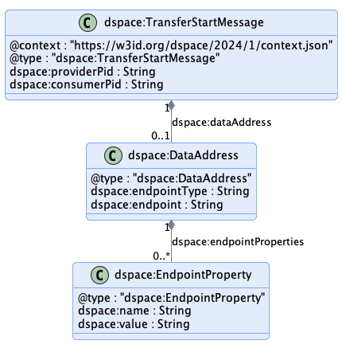
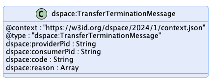
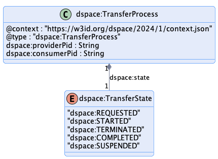
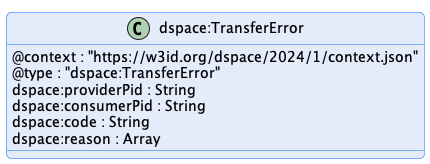

# Transfer Process Protocol

This document outlines the key elements of the [Transfer Process Protocol](../model/terminology.md#transfer-process-protocol). The used terms are described [here](../model/terminology.md).

* [1 Introduction](#1-introduction)
  * [1.1 Control and Data Planes](#11-control-and-data-planes)
  * [1.2 Dataset Transfer Types](#12-dataset-transfer-types)
    * [1.2.1 Push Transfer](#121-push-transfer)
    * [1.2.2 Pull Transfer](#122-pull-transfer)
    * [1.2.3 Finite and Non-Finite Data](#123-finite-and-non-finite-data)
  * [1.3 States](#13-states)
  * [1.4 State Machine](#14-state-machine)
* [2 Message Types](#2-message-types)
  * [2.1 Transfer Request Message](#21-transfer-request-message)
  * [2.2 Transfer Start Message](#22-transfer-start-message)
  * [2.3 Transfer Suspension Message](#23-transfer-suspension-message)
  * [2.4 Transfer Completion Message](#24-transfer-completion-message)
  * [2.5 Transfer Termination Message](#25-transfer-termination-message)
* [3 Response Types](#3-response-types)
  * [3.1 ACK - Transfer Process](#31-ack---transfer-process)
  * [3.2 ERROR - Transfer Error](#32-error---transfer-error)

## 1 Introduction

A [Transfer Process](../model/terminology.md#transfer-process) (TP) involves two parties, a [Provider](../model/terminology.md#provider) that offers one or more [Datasets](../model/terminology.md#dataset) under a [Usage Policy](../model/terminology.md#policy) and [Consumer](../model/terminology.md#consumer) that requests [Datasets](../model/terminology.md#dataset). A TP progresses through a series of states, which are controlled by the [Provider](../model/terminology.md#provider) and [Consumer](../model/terminology.md#consumer) using messages. A TP transitions to another state as a result of an exchanged message.

A TP is managed by a [Connector](../model/terminology.md#connector--data-service-). The [Connector](../model/terminology.md#connector--data-service-) serves as a coordinating technical entity that receives counter-party messages and manages its local state of the TP. It may as well also operate the hosting of the [Datasets](../model/terminology.md#dataset), or control their offering through another system.

### 1.1 Control and Data Planes
A TP is managed by a [Connector](../model/terminology.md#connector--data-service-). The [Connector](../model/terminology.md#connector--data-service-) consists of two logical components, a _Control Plane_ and a _Data Plane_. The Control Plane serves as a coordinating layer that receives counter-party messages and manages the TP state. The Data Plane performs the actual transfer of [Datasets](../model/terminology.md#dataset) using a wire protocol. Both participants run Control and Data Planes.

It is important to note that the Control and Data Planes are logical constructs. Implementations may choose to deploy both components within a single process or across heterogeneous clusters.

### 1.2 Dataset Transfer Types

[Dataset](../model/terminology.md#dataset) transfers are characterized as `push` or `pull` transfers and it's data is either `finite` or `non-finite`. This section describes the difference between these types.

#### 1.2.1 Push Transfer

A push transfer is when the [Provider's](../model/terminology.md#provider) Data Plane initiates sending of data to a [Consumer](../model/terminology.md#consumer) endpoint. For example, after the [Consumer](../model/terminology.md#consumer) has issued a [Transfer Request Message](#21-transfer-request-message), the [Provider](../model/terminology.md#provider) begins data transmission to an endpoint specified by the [Consumer](../model/terminology.md#consumer) using an agreed-upon wire protocol.

#### 1.2.2 Pull Transfer

A pull transfer is when the [Consumer](../model/terminology.md#consumer) Data Plane initiates retrieval of data from a [Provider](../model/terminology.md#provider) endpoint. For example, after the [Provider](../model/terminology.md#provider) has issued a [Transfer Start Message](#22-transfer-start-message), the [Consumer](../model/terminology.md#consumer) can request the data from the [Provider](../model/terminology.md#provider)-specified endpoint.

#### 1.2.3 Finite and Non-Finite Data

Data may be `finite` or `non-finite.` Finite data is data that is defined by a finite set, for example, machine learning data or images. After finite data transmission has finished, the TP is completed. Non-finite data is data that is defined by an infinite set or has no specified end, for example streams or an API endpoint. With non-finite data, a TP will continue indefinitely until either the [Consumer](../model/terminology.md#consumer) or [Provider](../model/terminology.md#provider) explicitly terminates the transmission.

### 1.3 States

The TP states are:

- **REQUESTED**: A [Dataset](../model/terminology.md#dataset) has been requested under an [Agreement](../model/terminology.md#agreement) by the [Consumer](../model/terminology.md#consumer) and the [Provider](../model/terminology.md#provider) has sent an ACK response.
- **STARTED**: The [Dataset](../model/terminology.md#dataset) is available for access by the [Consumer](../model/terminology.md#consumer) or the [Provider](../model/terminology.md#provider) has begun pushing the data to the [Consumer](../model/terminology.md#consumer) endpoint.
- **COMPLETED**: The transfer has been completed by either the [Consumer](../model/terminology.md#consumer) or the [Provider](../model/terminology.md#provider).
- **SUSPENDED**: The transfer has been suspended by the [Consumer](../model/terminology.md#consumer) or the [Provider](../model/terminology.md#provider).
- **TERMINATED**: The [Transfer Process](../model/terminology.md#transfer-process) has been terminated by the [Consumer](../model/terminology.md#consumer) or the [Provider](../model/terminology.md#provider).

### 1.4 State Machine

The TP state machine is represented in the following diagram:

Transitions marked with `C` indicate a message sent by the [Consumer](../model/terminology.md#consumer), transitions marked with `P` indicate a [Provider](../model/terminology.md#provider) message. Terminal states are final; the state machine may not transition to another state.

## 2 Message Types

All messages must be serialized in JSON-LD compact form as specified in the [JSON-LD 1.1 Processing Algorithms and API](https://www.w3.org/TR/json-ld11-api/#compaction-algorithms). Further Dataspace specifications may define additional optional serialization formats.

### 2.1 Transfer Request Message

|                     |                                                                                                                                       |
|---------------------|---------------------------------------------------------------------------------------------------------------------------------------|
| **Sent by**         | [Consumer](../model/terminology.md#consumer)                                                                                          |
| **Resulting state** | `REQUESTED`                                                                                                                           |
| **Response**        | [ACK](#31-ack---transfer-process) or [ERROR](#32-error---transfer-error)                                                              |
| **Schema**          | [TTL Shape](./message/shape/transfer-request-message-shape.ttl), [JSON Schema](./message/schema/transfer-request-message-schema.json) |
| **Example**         | [Message](./message/example/transfer-request-message.json)                                                                            |
| **Diagram(s)**      |                                                                                    |

The Transfer Request Message is sent by a [Consumer](../model/terminology.md#consumer) to initiate a TP.

- The `consumerPid` property refers to the transfer id of the [Consumer](../model/terminology.md#consumer) side.
- The `agreementId` property refers to an existing contract [Agreement](../model/terminology.md#agreement) between the [Consumer](../model/terminology.md#consumer) and [Provider](../model/terminology.md#provider).
- The `dct:format` property is a format specified by a `Distribution` for the [Dataset](../model/terminology.md#dataset) associated with the [Agreement](../model/terminology.md#agreement). This is generally obtained from the [Provider's](../model/terminology.md#provider) [Catalog](../model/terminology.md#catalog).
- The `dataAddress` property must only be provided if the `dct:format` requires a push transfer.
- The `dataAddress` contains a transport-specific endpoint address for pushing the data. It may include a temporary authorization via the `endpointProperties` property.
- `callbackAddress` is a URI indicating where messages to the [Consumer](../model/terminology.md#consumer) should be sent. If the address is not understood, the [Provider](../model/terminology.md#provider) MUST return an UNRECOVERABLE error.

Note that [Providers](../model/terminology.md#provider) should implement idempotent behavior for [Transfer Request Messages](#21-transfer-request-message) based on the value of `consumerPid`. [Providers](../model/terminology.md#provider) may choose to implement idempotent behavior for a certain period of time. For example, until a TP has completed and been archived after an implementation-specific expiration period, repeated sending of [Transfer Request Messages](#21-transfer-request-message) does not change the state of the TP. If a request for the given `consumerPid` has already been received *and* the same [Consumer](../model/terminology.md#consumer) sent the original message again, the [Provider](../model/terminology.md#provider) should respond with an appropriate [Transfer Start Message](#22-transfer-start-message).

- Once a TP has been created, all associated callback messages must include a `consumerPid` and `providerPid`.
- [Providers](../model/terminology.md#provider) must include a `consumerPid` and a `providerPid` property in the object.
- Valid states of a TP are `REQUESTED`, `STARTED`, `TERMINATED`, `COMPLETED`, and `SUSPENDED`.

### 2.2 Transfer Start Message

|                     |                                                                                                                                   |
|---------------------|-----------------------------------------------------------------------------------------------------------------------------------|
| **Sent by**         | [Provider](../model/terminology.md#provider)                                                                                      |
| **Resulting state** | `STARTED`                                                                                                                         |
| **Response**        | [ACK](#31-ack---transfer-process) or [ERROR](#32-error---transfer-error)                                                          |
| **Schema**          | [TTL Shape](./message/shape/transfer-start-message-shape.ttl), [JSON Schema](./message/schema/transfer-start-message-schema.json) |
| **Example**         | [Message](./message/example/transfer-start-message.json)                                                                          |
| **Diagram(s)**      |                                                                                  |

The Transfer Start Message is sent by the [Provider](../model/terminology.md#provider) to indicate the data transfer has been initiated.

- The `dataAddress` is only provided if the current transfer is a pull transfer and contains a transport-specific endpoint address for obtaining the data. It may include a temporary authorization via the `endpointProperties` property.

### 2.3 Transfer Suspension Message

|                     |                                                                                                                                             |
|---------------------|---------------------------------------------------------------------------------------------------------------------------------------------|
| **Sent by**         | [Consumer](../model/terminology.md#consumer), [Provider](../model/terminology.md#provider)                                                  |
| **Resulting state** | `SUSPENDED`                                                                                                                                 |
| **Response**        | [ACK](#31-ack---transfer-process) or [ERROR](#32-error---transfer-error)                                                                    |
| **Schema**          | [TTL Shape](./message/shape/transfer-suspension-message-shape.ttl), [JSON Schema](./message/schema/transfer-suspension-message-schema.json) |
| **Example**         | [Message](./message/example/transfer-suspension-message.json)                                                                               |
| **Diagram(s)**      |                                                                                       |

The Transfer Suspension Message is sent by the [Provider](../model/terminology.md#provider) or [Consumer](../model/terminology.md#consumer) when either of them needs to temporarily suspend the TP.

### 2.4 Transfer Completion Message

|                     |                                                                                                                                             |
|---------------------|---------------------------------------------------------------------------------------------------------------------------------------------|
| **Sent by**         | [Consumer](../model/terminology.md#consumer), [Provider](../model/terminology.md#provider)                                                  |
| **Resulting state** | `COMPLETED`                                                                                                                                 |
| **Response**        | [ACK](#31-ack---transfer-process) or [ERROR](#32-error---transfer-error)                                                                    |
| **Schema**          | [TTL Shape](./message/shape/transfer-completion-message-shape.ttl), [JSON Schema](./message/schema/transfer-completion-message-schema.json) |
| **Example**         | [Message](./message/example/transfer-completion-message.json)                                                                               |
| **Diagram(s)**      |                                                                                       |

The Transfer Completion Message is sent by the [Provider](../model/terminology.md#provider) or [Consumer](../model/terminology.md#consumer) when a data transfer has completed. Note that some connector implementations may optimize completion notification by performing it as part of their wire protocol. In those cases, a Transfer Completion Message does not need to be sent.

### 2.5 Transfer Termination Message

|                     |                                                                                                                                               |
|---------------------|-----------------------------------------------------------------------------------------------------------------------------------------------|
| **Sent by**         | [Consumer](../model/terminology.md#consumer), [Provider](../model/terminology.md#provider)                                                    |
| **Resulting state** | `TERMINATED`                                                                                                                                  |
| **Response**        | [ACK](#31-ack---transfer-process) or [ERROR](#32-error---transfer-error)                                                                      |
| **Schema**          | [TTL Shape](./message/shape/transfer-termination-message-shape.ttl), [JSON Schema](./message/schema/transfer-termination-message-schema.json) |
| **Example**         | [Message](./message/example/transfer-termination-message.json)                                                                                |
| **Diagram(s)**      |                                                                                        |

The Transfer Termination Message is sent by the [Provider](../model/terminology.md#provider) or [Consumer](../model/terminology.md#consumer) at any point except a terminal state to indicate the TP should stop and be placed in a terminal state. If the termination was due to an error, the sender may include error information.

## 3 Response Types

The `ACK` and `ERROR` response types are mapped onto a protocol such as HTTPS. A description of an error might be provided in protocol-dependent forms, e.g., for an HTTPS binding in the request or response body.

### 3.1 ACK - Transfer Process

|                 |                                                                                                                       |
|-----------------|-----------------------------------------------------------------------------------------------------------------------|
| **Sent by**     | [Consumer](../model/terminology.md#consumer), [Provider](../model/terminology.md#provider)                            |
| **Schema**      | [TTL Shape](./message/shape/transfer-process-shape.ttl), [JSON Schema](./message/schema/transfer-process-schema.json) |
| **Example**     | [Process](./message/example/transfer-process.json)                                                                    |
| **Diagram(s)**  |                                                                            |

The Transfer Process is an object returned by a [Consumer](../model/terminology.md#consumer) or [Provider](../model/terminology.md#provider) indicating a successful state change happened.

### 3.2 ERROR - Transfer Error

|                 |                                                                                                                   |
|-----------------|-------------------------------------------------------------------------------------------------------------------|
| **Sent by**     | [Consumer](../model/terminology.md#consumer), [Provider](../model/terminology.md#provider)                        |
| **Schema**      | [TTL Shape](./message/shape/transfer-error-shape.ttl), [JSON Schema](./message/schema/transfer-error-schema.json) |
| **Example**     | [Process](./message/example/transfer-error.json)                                                                  |
| **Diagram(s)**  |                                                                          |

The Transfer Error is an object returned by a [Consumer](../model/terminology.md#consumer) or [Provider](../model/terminology.md#provider) indicating an error has occurred. It does not cause a state transition.

| Field         | Type          | Description                                                            |
|---------------|---------------|------------------------------------------------------------------------|
| `consumerPid` | UUID          | The TF unique id on [Consumer](../model/terminology.md#consumer) side. |
| `providerPid` | UUID          | The TF unique id on [Provider](../model/terminology.md#provider) side. |
| `code`        | string        | An optional implementation-specific error code.                        |
| `reasons`     | Array[object] | An optional array of implementation-specific error objects.            |